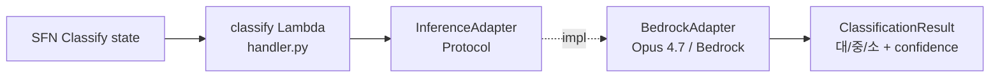
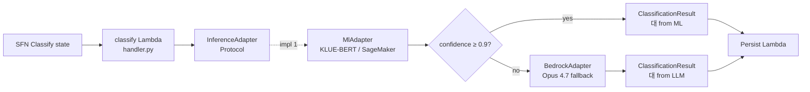

# ADR-001: Pluggable InferenceAdapter for LLM ↔ ML interchangeability

- **Status**: Accepted
- **Date**: 2026-05-22 (재문서화 2026-05-27)
- **Deciders**: project owner
- **Affects**: `src/lib/inference_adapter.py`, `src/lib/bedrock_client.py`, `src/lambdas/classify/handler.py`, Phase 3 ML migration

## Context

Phase 1 은 Bedrock Opus 4.7 (LLM) 로 분류한다. 그러나 spec §3.7 의 MLOps 로드맵에서 HITL 라벨 누적이 일정 임계 (~500 건) 를 넘으면 KLUE-BERT 같은 fine-tuned ML 모델로 **대분류 캐스케이드** 를 도입하기로 설계되었다.

이 전환을 다음 조건으로 가능하게 해야 한다:
- Step Functions ASL 정의 변경 0건
- 다른 Lambda (pii_guard / verify / persist) 코드 변경 0건
- DDB 스키마 변경 0건
- 분류 결과 JSON 스키마는 동일 유지
- 운영팀이 ML adopt 여부를 환경 변수만으로 토글 가능

## Decision

`src/lib/inference_adapter.py` 에 **`InferenceAdapter` Protocol** 을 정의한다. 모든 분류 호출은 이 추상을 거치며, `classify` Lambda 는 Protocol 인터페이스만 import 한다. 구현체 두 개를 두고 Phase 3 에 추가 구현체를 plug-in:

- `BedrockAdapter` (Phase 1, `src/lib/bedrock_client.py`)
- `MlAdapter` (Phase 3, SageMaker Endpoint 호출, 미작성)

`classify` Lambda 가 `confidence < threshold` 인 경우만 LLM 으로 폴백하는 **캐스케이드** 가 Phase 3 의 핵심 전략이다.

## Architecture Flow

### Phase 1 (현재)

### Phase 3 (계획)

## Consequences

### Positive
- Phase 3 ML 도입이 classify Lambda 한 줄 변경 (어댑터 instantiation) 으로 가능. SFN/다른 Lambda/DDB 변경 0건.
- Unit 테스트에서 `BedrockAdapter` 를 `MagicMock` 으로 손쉽게 치환 (`patch("lib.bedrock_client.boto3.client", ...)`).
- 다른 LLM provider (예: 자체 호스팅 Qwen, OpenAI 호환 endpoint) 도 같은 인터페이스로 plug-in.

### Negative
- 한 단계의 indirection — handler 가 어댑터 instantiation 코드 (`_ADAPTER = BedrockAdapter(...)`) 필요. 일반 함수 호출보다 1 stack 더 깊음.
- `ClassificationResult` dataclass 변경 시 모든 어댑터 일제 수정 필요 (이건 인터페이스 안정성을 강제하는 면도 있어 trade-off).

### Neutral
- Protocol 은 mypy strict mode 에서 인터페이스 일치 검증 (실제 implementation 이 `name`, `version`, `classify` 셋을 모두 갖춰야 함).

## Alternatives Considered

### Option A: Direct Bedrock call from handler
간단하지만 Phase 3 ML 도입 시 classify Lambda 의 모든 호출 지점을 if-else 로 감싸야 함. 다른 Lambda (verify) 도 같은 패턴 반복.

### Option B: SFN state 분기로 LLM vs ML 라우팅
ASL 정의가 dual-path 가 되어 시각적 복잡도 증가. Choice state 가 매 호출당 분기.

### Option C: Bedrock + Anthropic API 양쪽 지원
Anthropic API 는 본 프로젝트 정책상 외부 호출 금지 (PII spec §1.3) — 사용 안 함.

## Implementation Notes

- 변경 파일: `src/lib/inference_adapter.py` 신규, `src/lib/bedrock_client.py` 가 Protocol 만족, `src/lambdas/classify/handler.py` 가 `_ADAPTER = BedrockAdapter(...)` 모듈-레벨 초기화.
- Phase 3 진입 시: `src/lib/ml_adapter.py` 신규 + classify handler 에서 임계값 기반 fallback 로직 추가.
- 마이그레이션 단계는 plan `docs/superpowers/plans/2026-05-22-phase3-mlops-continuous-learning.md` 의 ML-PR1 에서 다룬다.

## References

- 관련 코드: `src/lib/inference_adapter.py`, `src/lib/bedrock_client.py:18-46`
- 관련 spec/plan: `docs/superpowers/specs/2026-05-22-callcenter-stt-classification-design.md` §3.7, `docs/superpowers/plans/2026-05-22-phase3-mlops-continuous-learning.md` ML-PR1
- Python Protocol 문서: https://docs.python.org/3/library/typing.html#typing.Protocol
