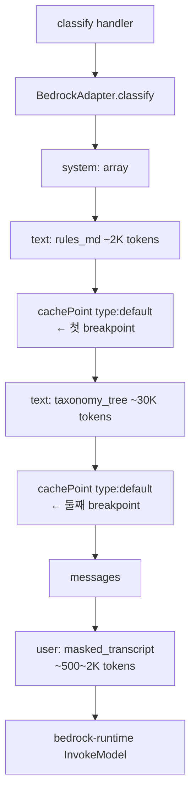
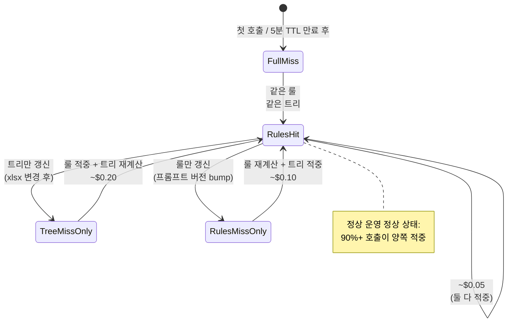

# ADR-002: Two-breakpoint Bedrock prompt cache (rules block + taxonomy tree block)

- **Status**: Accepted
- **Date**: 2026-05-22 (재문서화 2026-05-27)
- **Deciders**: project owner
- **Affects**: `src/lib/prompts.py`, `src/lib/bedrock_client.py`, Bedrock 비용

## Context

분류 프롬프트의 system block 은 두 부분으로 구성된다:
1. **룰 블록** (`system_rules.md`) — R1~R5, 출력 JSON 스키마, 모델 역할. ~2K tokens. 거의 변경 없음 (프롬프트 버전 bump 시에만).
2. **분류 트리 블록** (`taxonomy_tree.json` 의 serialized markdown) — 18 대분류 + 64 중분류 + 131 소분류 + 각 노드 description. ~30K tokens. xlsx 원본 갱신 시에만 변경.

총 ~32K input tokens. Bedrock Opus 4.7 의 cache hit 적용 시 호출당 ~$0.05 (그렇지 않으면 ~$0.50). 일 1만 건 트래픽 가정 시 cache 활용 여부가 **약 $50/일** 차이 (월 $1,500).

기본 cache 전략 후보:
- **A. 단일 cache breakpoint** — 룰 + 트리 합쳐 한 블록. xlsx 한 글자 갱신 시 32K token 전체 cache miss.
- **B. cache 미사용** — 모든 호출에 32K token full 비용.
- **C. 두 breakpoint** — 룰 / 트리 분리. 룰 변경과 트리 변경이 독립이므로 한쪽 변경이 다른쪽 cache 적중률에 영향 0.

## Decision

**Option C** 채택. 두 system block 사이에 명시적 `{"cachePoint": {"type": "default"}}` 항목 삽입.

## Architecture Flow

### Bedrock Converse 호출 구조

### 캐시 적중률 시나리오

## Consequences

### Positive
- xlsx 변경 시 트리만 invalidate, 룰 block 적중 유지 → 부분적 cache utilization
- 룰 (R1~R5) 만 강화 (예: R5 PII 룰 추가 어휘) 변경 시 트리는 영향 0
- Bedrock 5-min TTL 안에서 운영 trafifc 가 정상이면 적중률 90%+
- 비용 추정 (일 10K 건): cache 적중 → ~$25, 무적중 → ~$250. 차이 10배

### Negative
- prompt builder 가 system blocks 를 `list[str]` 로 분리 관리 — 단순 string 보다 약간 복잡
- Bedrock Converse API 의 `cachePoint` 가 비교적 새로운 기능 (boto3-stubs `SystemContentBlockTypeDef` 가 아직 미정의) → `# type: ignore[arg-type]` 필요. ADR 별도 trade-off 확인

### Neutral
- 트래픽이 매우 낮을 때 (분당 1건 미만) 5분 TTL 이 만료되어 모든 호출이 full miss. 그러나 그 트래픽에서는 절대 비용도 낮음.
- 워밍 핑 (5분마다 dummy 호출) 옵션은 spec §3.1 에 언급되어 있고 PR9 에서 검토 예정.

## Alternatives Considered

### Option A: 단일 breakpoint
spec text 가 처음 검토했던 안. cache 동작은 작동하지만 트리 변경 시 룰 block 까지 무효화 → ~20% 비용 손실.

### Option B: Cache 미사용
가장 단순. xlsx + 룰 어느 변경도 cache miss 영향 0. 하지만 모든 호출에 full token 비용 — 일 10K 건이면 월 $7,500.

### Option D: Dynamic few-shot (RAG) 보강 (Phase 2.5)
spec §3.7.5 의 합성 데이터 RAG 흐름과 결합 시 third cache breakpoint 추가 검토. Phase 1 범위 외.

## Implementation Notes

- `src/lib/prompts.py`: `PromptBundle.system_blocks` 가 `list[str]` (Phase 1 에서 항상 길이 2). `build_prompt_bundle()` 가 두 source (`rules_md`, `taxonomy_json`) 를 받아 빌드.
- `src/lib/bedrock_client.py:25-34`: `classify()` 가 `system` array 를 `[{text}, {cachePoint}, {text}, {cachePoint}]` 순서로 조립.
- 워밍 ping 미구현. PR9 observability 에서 EventBridge cron + Lambda 추가 검토.

## References

- 관련 코드: `src/lib/prompts.py:38-55`, `src/lib/bedrock_client.py:22-50`
- 관련 spec: §3.1 (프롬프트 구조), §5.4 (비용 추정)
- AWS Bedrock prompt caching: https://docs.aws.amazon.com/bedrock/latest/userguide/prompt-caching.html
