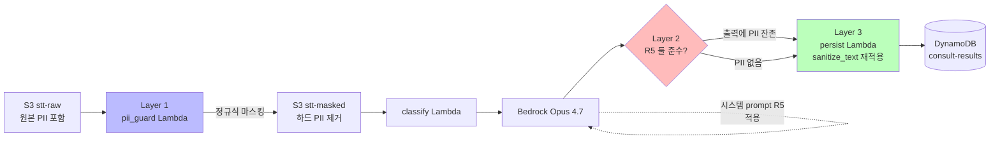
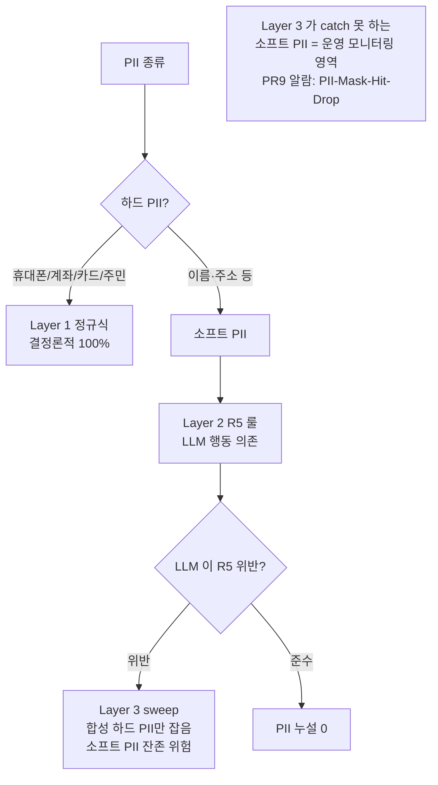

# ADR-003: Three-layer PII guard (regex pre-filter + R5 prompt rule + persist output sweep)

- **Status**: Accepted
- **Date**: 2026-05-22 (재문서화 2026-05-27)
- **Deciders**: project owner
- **Affects**: `src/lib/pii_regex.py`, `src/lambdas/pii_guard/handler.py`, `src/prompts/v1.0/system_rules.md`, `src/lib/persistence.py`

## Context

콜센터 STT 본문에 PII (고객명, 휴대폰, 계좌번호, 카드번호, 주민번호, 주소) 가 빈번히 포함된다. 본 시스템은 STT 를 Bedrock 으로 분류 호출하므로 PII 가 외부(Bedrock service)로 송신되는 흐름이 발생. KakaoPay 의 금융 도메인 컴플라이언스 기준상 PII 보호가 필수.

**의도된 위험 수준**:
- 하드 PII (계좌·카드·주민·휴대폰 등 정형 식별자) — 누설 시 즉시 critical incident
- 소프트 PII (고객명·주소 등 자유 텍스트) — 누설 위험 낮지만 0 은 아님

단일 가드 메커니즘 (예: regex 만, 또는 LLM masking 만) 은 한 종류라도 누락 시 전체 누설 가능. **defense-in-depth** 가 금융 도메인 기준.

## Decision

세 계층의 직교 (orthogonal) 가드 적용:

1. **Layer 1 — Regex pre-filter (deterministic, hard PII)**:
   `pii_guard` Lambda 가 raw STT JSON 을 읽어 `lib.pii_regex.mask()` 로 4 패턴 (계좌/카드+Luhn/주민/휴대폰) 을 결정론적으로 `[MASKED_*]` 토큰 치환. 결과를 S3 masked prefix 에 저장. Bedrock 은 마스킹된 본문만 본다.

2. **Layer 2 — Prompt rule R5 (LLM 행동 제약)**:
   `src/prompts/v1.0/system_rules.md` 의 R5: "reason / alternativesConsidered.why_rejected 필드에 PII 인용 금지. 일반화된 표현만 사용. 인용이 불가피하면 `[개인정보]` 로 대체." Bedrock 출력 자체가 PII 를 reflect 하지 않도록 지시.

3. **Layer 3 — Persist output sweep (synthetic PII)**:
   `persist` Lambda 가 DDB write 전 `lib.persistence.sanitize_text()` 가 동일 정규식을 `reason` / `alternativesConsidered.why_rejected` 에 재적용. LLM 이 만든 합성 PII (예: "예: 010-1234-5678" 같이 예시로 생성한 가짜 번호) 도 제거.

## Architecture Flow

### 어느 계층이 어떤 PII 를 잡나

## Consequences

### Positive
- 하드 PII 누설 위험은 사실상 0 (Layer 1 정규식 + Layer 3 sweep 양쪽 covered)
- 소프트 PII 누설은 LLM 거동 + 운영 모니터링으로 위험 관리 (영구 해결은 Phase 2 PII service)
- 각 계층은 독립 단위 테스트 가능 (`tests/unit/test_pii_regex.py`, `test_pii_guard_handler.py`, `test_persistence.py`)
- 운영 메트릭 가시화: `pii.maskApplied` 메트릭이 dim=PII_type 별로 적중 빈도 노출 → 회귀 조기 감지

### Negative
- 호출 흐름이 3 단계 → 디버그 시 어느 계층에서 무엇이 마스킹됐는지 추적 필요. 각 Lambda 가 별도 메트릭 emit 으로 가시화.
- 동일 정규식 패턴이 Layer 1, Layer 3 양쪽에 반영 — 룰 변경 시 양쪽 sync 필요. `src/lib/pii_regex.py` 한 모듈로 통합되어 있으므로 코드 중복 없음.
- 합성 PII (LLM 이 만든 예시 번호) 가 의도되지 않게 마스킹되어 `reason` 가독성 손상 가능. trade-off: 가독성 < 누설 위험.

### Neutral
- 한글 인접 숫자에서 `\b` boundary 가 작동하지 않으므로 `(?<!\d)/(?!\d)` 패턴 사용 (Layer 1 와 Layer 3 모두). 카드 정규식의 over-greedy 문제 회피 위해 digit count 기반 (`\d(?:[ -]?\d){12,18}`).
- Phase 2 진입 조건 (운영 1개월 후 누설률 >1%) 미충족 시 SageMaker Async + Qwen PII 서비스 도입.

## Alternatives Considered

### Option A: LLM-only masking (Layer 2 만)
순수 R5 룰만 사용. spec §4.2 에 명시된 위험: LLM 이 룰을 항상 100% 준수한다는 보장 없음. 단일 결정자 의존 → 회귀 위험.

### Option B: 정규식만 (Layer 1 만)
LLM 출력이 합성 PII 를 만드는 경우 (예시 번호) 차단 못 함. Layer 3 sweep 가 그것을 잡는 이유.

### Option C: Dedicated PII service (Phase 2 안)
SageMaker Async + Qwen2.5-7B-Instruct on GPU. Phase 1 의 단순성 / 비용을 위해 Phase 2 로 deferred. 진입 조건 spec §4.3 에 명시.

### Option D: Comprehend PII detection
AWS managed service. 한국어 PII 정확도가 낮고 (영문 기반 모델), 카드 Luhn 같은 정형 패턴은 정규식이 더 정확.

## Implementation Notes

- **Layer 1 위치**: SFN 의 첫 state (`PiiGuard`). 마스킹 결과를 S3 masked prefix 에 저장 (재현성 + 감사용). 메트릭 `pii.maskApplied` emit (dim = PII type).
- **Layer 2 위치**: `src/prompts/v1.0/system_rules.md` 의 R5 룰. 프롬프트 버전 bump 시 R5 변경 추적 가능.
- **Layer 3 위치**: `persist` Lambda 의 `build_ddb_item()` 안에서 `sanitize_text(reason)` / `sanitize_text(why_rejected)`. 길이 cap (reason 2000, why_rejected 500) 도 동시에 적용.
- **공유 모듈**: `src/lib/pii_regex.py` 가 Layer 1 + Layer 3 양쪽에서 import. `lib.persistence.sanitize_text()` 가 wrapper.
- **테스트**: 카드 over-greedy 회귀 (예: `"참고 0 4532-..."`) 의 회귀 테스트 `test_card_not_over_eaten_when_preceded_by_short_digit` 포함.

## References

- 관련 코드: `src/lib/pii_regex.py`, `src/lambdas/pii_guard/handler.py:30-60`, `src/prompts/v1.0/system_rules.md` R5, `src/lib/persistence.py:11-20`, `src/lambdas/persist/handler.py:37-45`
- 관련 spec: §4 (PII 처리 Phase 1), §7.4 (보안)
- Phase 2 진입 plan: `docs/superpowers/plans/2026-05-22-phase1-callcenter-classification.md` Phase 2 진입 조건
