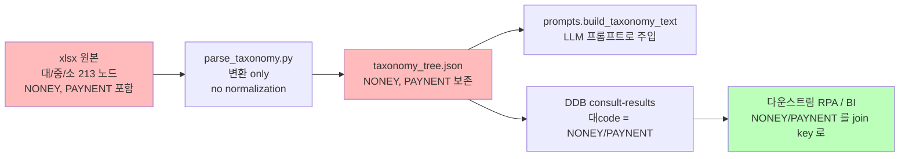
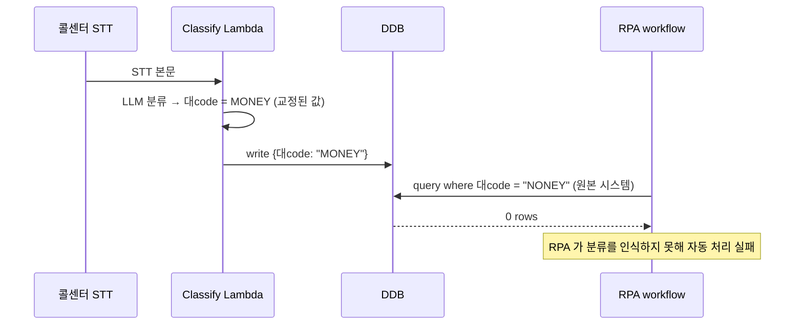

# ADR-004: xlsx 코드 식별자(NONEY/PAYNENT) 오타를 시스템 식별자로 보존

- **Status**: Accepted
- **Date**: 2026-05-22 (재문서화 2026-05-27)
- **Deciders**: project owner
- **Affects**: `상담어시스트_AWS전달자료.xlsx`, `scripts/parse_taxonomy.py`, `src/taxonomy/taxonomy_tree.json`

## Context

원본 xlsx (`상담어시스트_AWS전달자료.xlsx`) 의 대/중/소 분류 213 노드에 두 개의 명백한 영문 오타가 코드 컬럼에 포함:

- `NONEY` — 의도된 영문은 `MONEY` (송금 도메인). 실제 xlsx 코드값.
- `PAYNENT` — 의도된 영문은 `PAYMENT` (결제 도메인). 실제 xlsx 코드값.

`scripts/parse_taxonomy.py` 가 xlsx 를 읽어 `taxonomy_tree.json` 으로 변환. 변환 과정에서 "오타를 자동 교정"할지가 결정 사안.

**핵심 사실**: 이 코드 값은 KakaoPay 콜센터 운영 시스템에서 이미 **system identifier** 로 사용 중이다. 분류 결과의 `대code` 필드가 다운스트림 시스템 (BI 분석, RPA, 워크플로우 라우팅) 의 join key 로 쓰인다. 자체적으로 "올바른 영문 단어" 로 교정하면 다운스트림과 mismatch.

## Decision

**xlsx 의 코드 값을 절대 수정하지 않는다.** `NONEY` / `PAYNENT` 를 그대로 보존한다.

- `parse_taxonomy.py` 가 어떤 normalization 도 적용하지 않음 — 코드 컬럼은 원문 그대로 읽어 JSON 으로 출력
- 다른 영문 식별자 (예: `INQUIRY`, `COMPLAINT`) 도 그대로 보존
- Linter / spell-checker / dictionary 기반 자동 교정 도구 도입 시 이 두 토큰을 ignore-list 에 등록 필요

## Architecture Flow

### 만약 "교정"했다면 발생할 mismatch

## Consequences

### Positive
- 다운스트림 시스템과 100% 호환 — 분류 결과를 RPA / BI / 분석에서 즉시 사용 가능
- xlsx 가 single source of truth 유지 — 운영팀이 xlsx 만 관리하면 됨
- 향후 코드 값 변경 시 xlsx 만 수정하면 시스템 전체 반영

### Negative
- 영문 오타가 코드베이스 전체에 노출 (LLM prompt, DDB, 로그, 알람) — 신규 합류자가 혼란 가능
- IDE / linter / spell-checker 가 false positive 보고 가능. ignore-list 필요.
- 운영팀이 "오타니까 고치자" 라고 제안할 위험. ADR 로 결정 근거 명문화하여 방어.

### Neutral
- 한국어 분류명 (`송금`, `결제`) 은 그대로 유지 — 영문 코드와 한국어 라벨은 별개 컬럼.
- 만약 운영팀이 정식 절차로 xlsx 코드 값 변경을 결정하면, 다운스트림 시스템 사전 마이그레이션 후 xlsx 변경. 그때까지는 보존.

## Alternatives Considered

### Option A: Parser 에서 자동 교정 (`NONEY → MONEY`, `PAYNENT → PAYMENT`)
다운스트림 mismatch 발생. RPA 자동 처리 실패. 명확한 거부.

### Option B: 영문 코드 신규 매핑 (legacy_code + canonical_code 컬럼 분리)
xlsx 스키마 변경 필요. 운영팀 합의 미확보. Phase 2+ 로 deferred.

### Option C: 한국어 코드만 사용 (영문 코드 폐기)
xlsx 스키마 변경 + 다운스트림 전면 마이그레이션 필요. 범위 초과.

## Implementation Notes

- `scripts/parse_taxonomy.py` — `code` 필드 값을 `.strip()` 만 적용, normalization / lowercase / replace 절대 사용 금지
- `src/lib/prompts.py` — `build_taxonomy_text()` 가 JSON 의 `code` 를 그대로 LLM 프롬프트에 주입
- `tests/unit/test_parse_taxonomy.py` — `assert "NONEY" in taxonomy_text` 회귀 테스트 포함
- 코드 리뷰 가이드: PR 에서 `NONEY` / `PAYNENT` 를 "fix" 하려는 변경 발견 시 본 ADR 링크하여 reject

## References

- 관련 코드: `scripts/parse_taxonomy.py`, `src/taxonomy/taxonomy_tree.json`, `src/lib/prompts.py:build_taxonomy_text`
- 관련 xlsx 컬럼: 대분류 코드, 중분류 코드, 소분류 코드
- 관련 spec: §2.1 (taxonomy 입력 명세)
