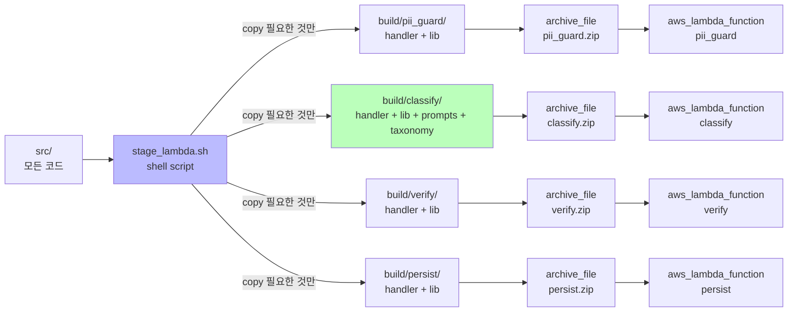
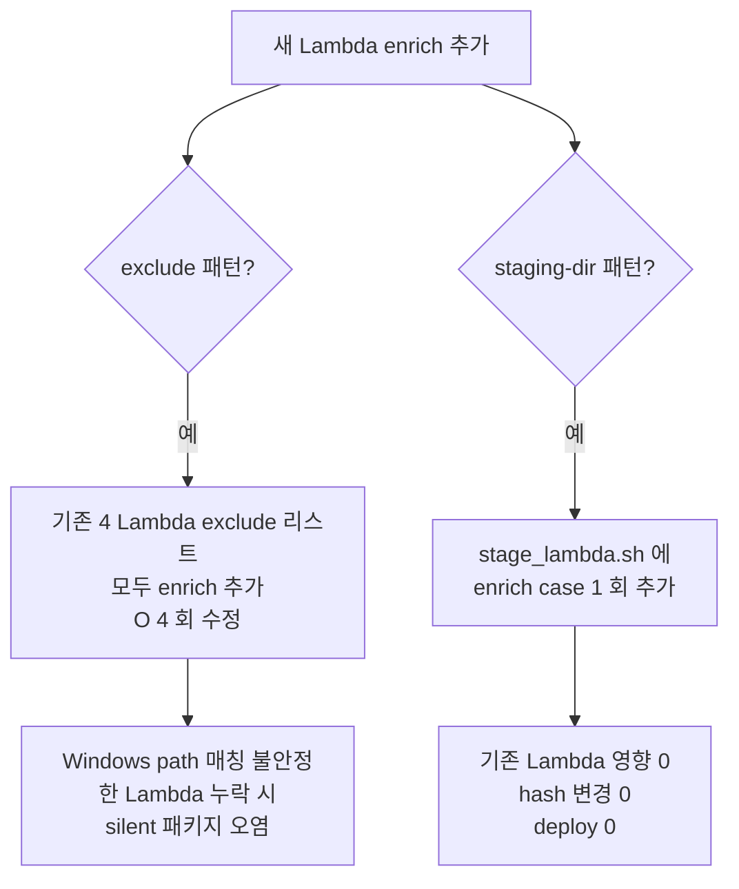

# ADR-005: per-Lambda staging-dir Terraform packaging

- **Status**: Accepted
- **Date**: 2026-05-22 (재문서화 2026-05-27)
- **Affects**: `infra/modules/classify-pipeline/main.tf`, `infra/modules/classify-pipeline/scripts/stage_lambda.sh`

## Context

Lambda 코드 패키징은 `archive_file` data source 가 ZIP 생성하는 방식. 그러나 모든 Lambda 가 같은 source root (`src/`) 를 공유하므로, naive 한 `source_dir = "${path.module}/../../../src"` 패턴 사용 시 모든 Lambda ZIP 에 4 개 핸들러 + 공유 lib 가 모두 포함됨. 결과:

- `pii_guard` Lambda ZIP 에 `classify/handler.py`, `verify/handler.py`, `persist/handler.py` 도 포함
- 패키지 크기 4 배 ↑
- Lambda cold start latency ↑
- 하나의 handler 코드 변경이 전체 4 Lambda 의 hash 변경 → 불필요한 deploy

초기 안: `excludes = ["*/classify/*", "*/verify/*", ...]` 패턴. 문제:
- exclusion 패턴이 길어지면 누락 위험
- glob 매칭이 OS/Terraform 버전마다 미묘하게 다름 (특히 Windows path 경로)
- 새 Lambda 추가 시 모든 기존 Lambda 의 exclude 리스트 업데이트 필요 — O(N²) 관리 비용

## Decision

각 Lambda 마다 **별도 staging directory** 를 만들고, 필요한 파일만 복사한 후 ZIP 한다.

```hcl
data "external" "<name>_stage" {
  program = ["bash", "${path.module}/scripts/stage_lambda.sh", "<name>"]
}

data "archive_file" "<name>" {
  type        = "zip"
  source_dir  = data.external.<name>_stage.result.staging_dir
  output_path = "${path.module}/build/<name>.zip"
}
```

`scripts/stage_lambda.sh` 가:
1. `${path.module}/build/<name>/` 디렉토리 생성 (있으면 clean)
2. 해당 Lambda 의 핸들러만 복사 (`src/lambdas/<name>/*`)
3. 공유 lib 복사 (`src/lib/*`)
4. 필요 시 추가 의존 (`src/taxonomy/*`, `src/prompts/*`) 복사
5. staging dir 절대경로를 JSON `{"staging_dir": "..."}` 으로 stdout 출력

## Architecture Flow



### exclude 패턴 vs staging-dir 패턴 비교



## Consequences

### Positive
- 각 Lambda ZIP 이 자기 코드 + 필요한 의존만 포함 — 패키지 크기 최소
- 한 Lambda 의 코드 변경이 다른 Lambda 의 hash 에 영향 0 — Terraform plan 에서 변경 범위 명확
- 새 Lambda 추가 시 `stage_lambda.sh` 의 case 문에 1 회 추가 + 새 `data "external" / "archive_file"` 블록 1 회 추가 — O(1) 관리 비용
- staging dir 가 명시적 디렉토리이므로 디버그 시 inspect 용이 (`ls build/<name>/`)

### Negative
- `data "external"` 가 bash script 호출 — Terraform apply 시 외부 의존성 발생 (bash + cp 필요). CI runner / Atlantis 컨테이너에 보장됨.
- `build/` 디렉토리가 `.gitignore` 에 등록되어야 함 (`infra/modules/*/build/`).
- shell script 가 Linux/macOS 가정 — Windows 환경에서 동작 보장 안 함. (운영 환경 = Linux 만, 이슈 없음)

### Neutral
- `data "external"` 가 매 `terraform plan` 시 실행 → 다소의 plan 시간 증가. 4 Lambda × cp = <1s, 무시 가능.
- 향후 Phase 2 에서 Lambda Layer 도입 시 본 패턴 위에 layer 분리 추가 가능.

## Alternatives Considered

### Option A: 단일 source_dir + excludes (초기 안)
glob 매칭 OS 차이, 신규 Lambda 추가 시 O(N²) 관리 비용. 거부.

### Option B: Lambda Layer (공유 lib 분리)
운영 복잡성 증가 (Layer 버전 관리). Phase 1 의 단순성 우선 — 4 개 Lambda 모두 ZIP 자체 포함이 더 디버그하기 쉬움. Phase 3+ 에서 재검토.

### Option C: Container Image Lambda
ECR repo 관리 + Docker build 필요. Phase 1 scope 초과.

### Option D: 별도 sub-package per Lambda (`src/lambdas/<name>/` 가 자체 `pyproject.toml`)
Python 패키징 복잡도 증가. 4 개의 작은 패키지로 분할은 과도.

## Implementation Notes

- `infra/modules/classify-pipeline/scripts/stage_lambda.sh` — `case "$1"` 문으로 Lambda 마다 복사 대상 정의
- `data "external"` 의 stdout JSON 은 escape 처리 정확해야 — `jq -n --arg dir "$STAGING_DIR" '{staging_dir: $dir}'` 사용
- `.gitignore` 에 `infra/modules/*/build/` 추가됨
- `archive_file.output_path` 도 `build/` 안으로 위치 → git ignore 됨
- Terraform 1.9+ 에서 동작 확인 (`data "external"` provider ~> 2.3)

## References

- 관련 코드: `infra/modules/classify-pipeline/main.tf`, `infra/modules/classify-pipeline/scripts/stage_lambda.sh`
- Terraform docs: [external data source](https://registry.terraform.io/providers/hashicorp/external/latest/docs/data-sources/external)
- 관련 spec: §3.3 (Lambda 패키징)
