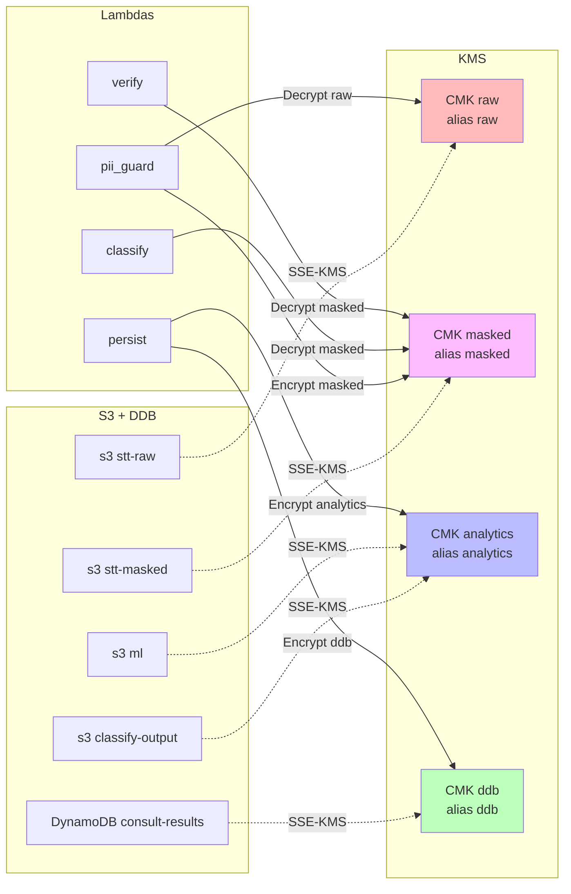
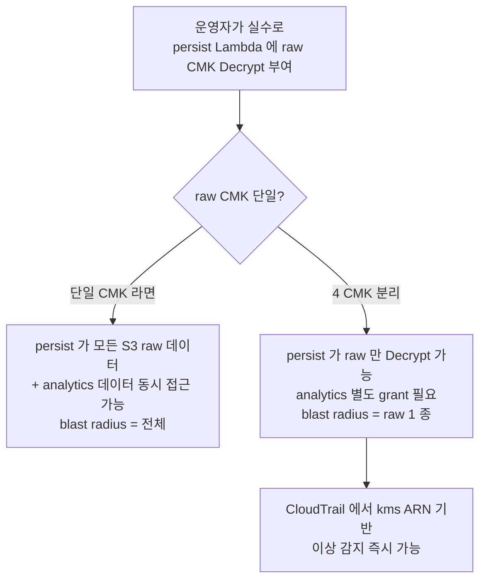

# ADR-006: KMS 데이터 클래스 분리 (4 개 CMK: raw / masked / analytics / ddb)

- **Status**: Accepted
- **Date**: 2026-05-22 (재문서화 2026-05-27)
- **Affects**: `infra/modules/storage/main.tf`, 각 Lambda IAM policy

## Context

본 시스템은 STT 데이터를 다음 4 가지 저장 단위로 분리하여 다룬다:

1. **raw STT** — 원본 PII 포함. 가장 민감.
2. **masked STT** — PII regex 마스킹 후. 중간 민감도.
3. **analytics** — Glue 가 분류 결과 + masked STT 를 join 한 BI 데이터셋. 분석팀 사용.
4. **DynamoDB** — 분류 결과 메타데이터 + sanitized reason. 핫 패스 조회.

**위협 모델**:
- 한 Lambda 의 IAM 권한이 잘못 부여되어 분석팀 데이터 접근 가능
- 한 KMS key 의 grant 가 leak 되어 모든 데이터 클래스 동시 노출
- DDB encryption 이 별도 grant 로 분리되지 않으면 S3 데이터 권한 검토만으로 보안 완전성 평가 불가

단일 CMK 로 모든 데이터를 암호화하면 위 위협이 한 곳에서 collapses — 보안 분리 원칙 위반.

## Decision

데이터 클래스 별로 별도 CMK 4 개 발행하고, 각 S3 버킷 / DDB 가 자기 클래스 CMK 만 사용한다. 각 Lambda IAM 은 필요한 CMK ARN 만 grant.

| CMK | 암호화 대상 | 사용 Lambda | Key alias |
|---|---|---|---|
| `raw` | `s3://stt-raw-*` | `pii_guard` (read), `classify` (X - 직접 안 봄) | `alias/callcenter-{env}-raw` |
| `masked` | `s3://stt-masked-*` | `pii_guard` (write), `classify` (read), `verify` (read) | `alias/callcenter-{env}-masked` |
| `analytics` | `s3://classify-output-*`, `s3://ml-*` | `persist` (write), Glue/Athena (read) | `alias/callcenter-{env}-analytics` |
| `ddb` | DynamoDB `consult-results` | `persist` (write), `classify`/`verify` (read for idempotency) | `alias/callcenter-{env}-ddb` |

각 Lambda IAM:
- `pii_guard` → raw kms:Decrypt + masked kms:Encrypt
- `classify` → masked kms:Decrypt
- `verify` → masked kms:Decrypt
- `persist` → ddb kms:Encrypt (+ firehose:PutRecord — analytics CMK 는 직접 grant 하지 않고 Firehose delivery role 이 보유)

`kms:*` 의 `Resource: "*"` 절대 사용 금지 — 항상 CMK ARN 명시.

## Architecture Flow

### 잘못된 IAM 부여가 미치는 영향 범위

## Consequences

### Positive
- 한 Lambda 권한 오류의 blast radius 가 1 데이터 클래스로 제한
- CloudTrail / KMS audit log 에서 CMK ARN 기반 이상 감지 가능 — "왜 classify Lambda 가 analytics CMK 접근?" 즉시 alert
- 향후 데이터 클래스 별 key rotation / 별도 컴플라이언스 정책 적용 가능
- Phase 3 에서 분석팀 read-only role 분리 시 analytics CMK 만 grant 하면 됨 — raw 노출 위험 0

### Negative
- 4 CMK = $1 × 4 / month = ~$4/month 베이스 비용 + API calls. 영향 미미.
- IAM policy 가 verbose — 각 Lambda 마다 CMK ARN 명시. 자동화 (Terraform output → IAM module) 필요.
- 신규 데이터 클래스 추가 시 신규 CMK + 모든 Lambda IAM 검토 필요. 단, 검토는 안전 측면이므로 의도된 friction.

### Neutral
- ml 버킷은 analytics CMK 공유 — 분석 데이터와 access pattern 동일. 의도적 결정. (3 개 CMK 면 부족, 5 개면 과도 → 4 개가 균형점)
- key policy 는 root + IAM 에 위임 (`kms:ViaService` condition 없음 — 다중 서비스 사용)
- `bucket_key_enabled = true` 로 KMS API 호출 비용 절감

## Alternatives Considered

### Option A: AWS managed KMS (`aws/s3`, `aws/dynamodb`)
키 정책 customization 불가, audit log 에서 데이터 클래스 구분 불가. 거부.

### Option B: 단일 CMK
blast radius 무제한. 거부.

### Option C: 2 CMK (sensitive: raw+masked / non-sensitive: analytics+ddb)
masked + analytics 혼동 가능. 4 클래스가 명확.

### Option D: 데이터 클래스 + 환경 별 = 12 CMK (dev/stg/prd × 4)
환경 분리는 KMS key policy 의 `aws:PrincipalAccount` 조건으로 충분. 4 CMK × workspace 가 더 단순. 다만 workspace 별 alias 분리는 유지 (`alias/callcenter-{env}-{class}`).

## Implementation Notes

- `infra/modules/storage/main.tf` — `aws_kms_key.raw`, `.masked`, `.analytics`, `.ddb` 4 리소스
- 각 `aws_kms_alias` 는 `alias/callcenter-${var.env}-${class}` 형식
- `aws_s3_bucket_server_side_encryption_configuration` 에서 `kms_master_key_id = aws_kms_key.<class>.arn`
- DDB `server_side_encryption { enabled = true; kms_key_arn = aws_kms_key.ddb.arn }`
- Lambda IAM (`infra/modules/classify-pipeline/main.tf` 의 인라인 `aws_iam_role_policy` 정의) 에서 `kms:Decrypt` 의 `Resource` 는 명시적 ARN list
- `persist` Lambda IAM 은 ddb CMK (`kms_ddb_arn`) 만 직접 grant — analytics 데이터는 `firehose:PutRecord` 로 Firehose 에 전달하고, analytics CMK (`kms_analytics_arn`) grant 는 Firehose delivery role (`infra/modules/analytics/main.tf` 의 `aws_iam_role_policy.firehose`) 이 보유한다

## References

- 관련 코드: `infra/modules/storage/main.tf` (kms_key 리소스 4개), `infra/modules/classify-pipeline/main.tf` (각 Lambda IAM 인라인 정의)
- 관련 spec: §7.4 (보안 / KMS 분리), §3.2 (S3 / KMS 매핑)
- AWS docs: [KMS key policies for S3](https://docs.aws.amazon.com/AmazonS3/latest/userguide/UsingKMSEncryption.html)
