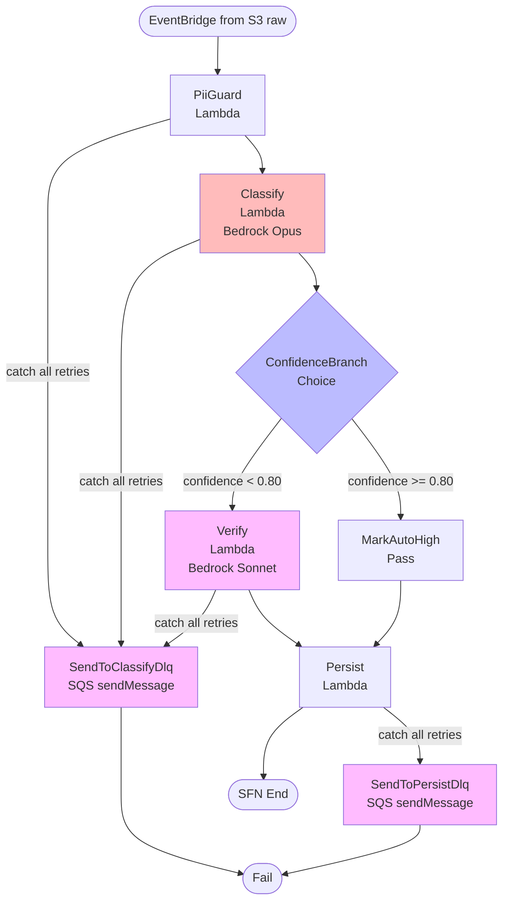
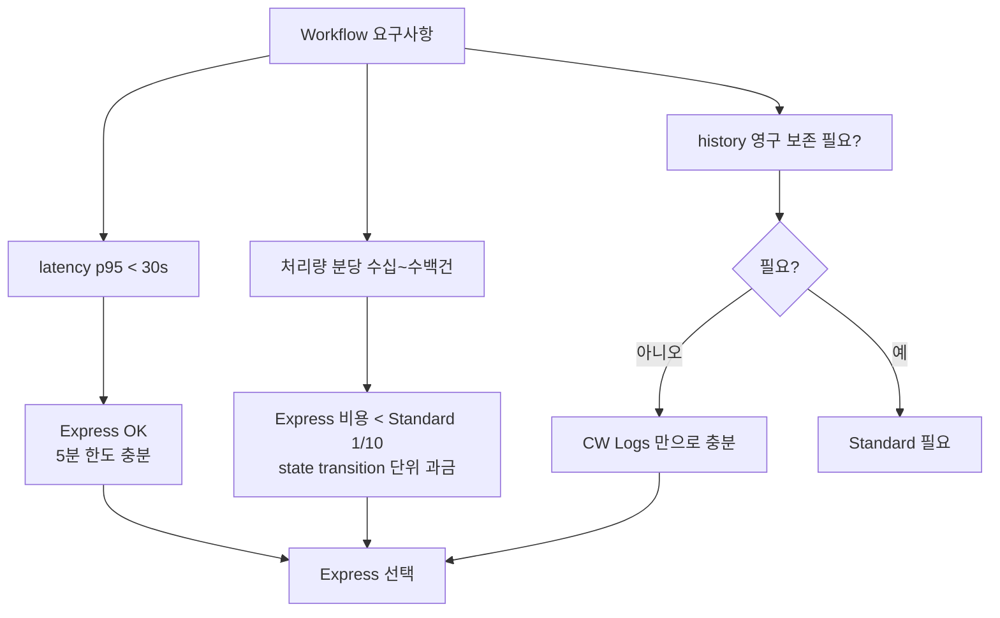

# ADR-007: Step Functions Express 8-state orchestration

- **Status**: Accepted
- **Date**: 2026-05-22 (재문서화 2026-05-27)
- **Affects**: `infra/modules/classify-pipeline/main.tf` 의 인라인 정의 (`aws_sfn_state_machine.definition = jsonencode({...})`)

## Context

S3 raw 버킷에 STT JSON 이 업로드되면 다음 단계를 거쳐 분류 결과를 DDB 에 저장해야 한다:

1. PII 마스킹
2. 분류 (Bedrock Opus)
3. confidence ≥ threshold 분기
4. 저신뢰 시 verify (Bedrock Sonnet 교차 검증)
5. DDB 저장

요구사항:
- 단위 step 마다 retry / catch 가능
- DLQ 분리 — classify 실패 vs persist 실패
- 단일 호출 latency p95 < 30s
- 비용 최소화 — 분당 수십 건 ~ 수백 건 처리

## Decision

**AWS Step Functions Express** 단일 state machine 으로 orchestration. **8 개 state**:

1. **PiiGuard** (Task / Lambda) — PII 마스킹
2. **Classify** (Task / Lambda) — Opus 분류
3. **ConfidenceBranch** (Choice) — confidence ≥ 0.80 분기
4. **Verify** (Task / Lambda) — Sonnet 교차 검증 (저신뢰만)
5. **MarkAutoHigh** (Pass) — 고신뢰 path 의 state 동기화
6. **Persist** (Task / Lambda) — DDB write + analytics S3 write
7. **SendToClassifyDlq** (Task / SQS sendMessage) — Catch 대상
8. **SendToPersistDlq** (Task / SQS sendMessage) — Catch 대상

Retry / Catch 정책:
- **Classify** state — `ThrottlingException` / `ServiceUnavailable` 에 5 회 retry (exponential, 2x backoff). 그 외 3 회. Catch → SendToClassifyDlq
- **Verify** state — 동일
- **Persist** state — DDB throttle 3 회 retry. Catch → SendToPersistDlq
- **PiiGuard** state — 2 회 retry, Catch → SendToClassifyDlq

ResultPath / OutputPath 패턴 모든 Task state 일관:
```json
"Parameters": { "Payload.$": "$" },
"ResultSelector": { "result.$": "$.Payload" },
"OutputPath": "$.result"
```

## Architecture Flow



### Standard vs Express 선택 근거



## Consequences

### Positive
- Express = 25,000 state transitions per $ (vs Standard 25 per $) — 250x 비용 절감
- p95 < 30s 충분 (5분 한도)
- Choice state 로 confidence branch 가 declarative — 코드 분기 < SFN 분기 의 가시성
- Catch / Retry 가 state machine 정의에 명시 — Lambda 코드에 retry 로직 누락 위험 0
- DLQ 분리로 incident 시 root cause 즉시 파악 (classify vs persist)

### Negative
- Express 는 execution history 자동 영구 저장 안 함 — CW Logs `INCLUDE_EXECUTION_DATA` 의존
- ResultPath / OutputPath 패턴이 정형화되어 있어 신규 state 추가 시 보일러플레이트
- Choice state 의 threshold (0.80) 가 state machine 정의에 hardcoded — 런타임 변경 불가, Terraform apply 필요. (의도된 설계 — threshold 변경은 deploy gate 통과해야)

### Neutral
- `ASL` 정의는 `infra/modules/classify-pipeline/main.tf` 의 `aws_sfn_state_machine.definition` 에 `jsonencode({...})` 인라인 — Lambda ARN, DLQ URL 은 Terraform 표현식으로 직접 주입
- 매 PR 의 `terraform validate` 가 ASL 정적 validation 까지 포함
- `tests/integration/test_sfn_definition.py` 가 state 이름 / 전이 구조 grep 검증

## Alternatives Considered

### Option A: Standard Step Functions
비용 250x. 영구 history 가 본 시스템에 불필요 (CW Logs 충분). 거부.

### Option B: Single fat Lambda (모든 단계를 한 Lambda 안에서)
- Lambda timeout 15분 한도 — Bedrock 호출 retry 시 timeout 위험
- 한 단계 실패 시 전체 재시도 → 비용 (Bedrock 비용 + Lambda 시간)
- DLQ 분리 불가
- 거부.

### Option C: SQS chain (Lambda → SQS → Lambda → SQS → ...)
- 각 단계마다 SQS 비용 + 메시지 visibility timeout 관리 복잡
- Catch / Retry 가 Lambda 코드 안에 산재
- Choice 분기 표현 어색
- 거부.

### Option D: AppFlow / Glue workflow
워크로드가 ETL 이 아닌 transactional. 부적합.

## Implementation Notes

- `infra/modules/classify-pipeline/main.tf` 의 `aws_sfn_state_machine.definition = jsonencode({...})` — ASL 인라인 정의. Lambda ARN, DLQ URL 을 Terraform 표현식으로 직접 주입.
- `aws_sfn_state_machine` 의 `type = "EXPRESS"`. `logging_configuration.level = "ALL"`, `include_execution_data = true`.
- IAM: SFN execution role 이 4 Lambda invoke + 2 SQS sendMessage 권한
- EventBridge rule 이 S3 raw 의 `ObjectCreated` 이벤트를 패턴 매칭 → SFN startExecution
- 회귀 테스트: `tests/integration/test_sfn_definition.py` 가 8 state 이름 + transitions grep
- W3 PR9 에서 SFN execution status alarm 추가 (실패율 임계)

## References

- 관련 코드: `infra/modules/classify-pipeline/main.tf` (`aws_sfn_state_machine` 의 `definition = jsonencode({...})` 인라인 정의)
- AWS docs: [SFN Express vs Standard](https://docs.aws.amazon.com/step-functions/latest/dg/concepts-standard-vs-express.html)
- 관련 spec: §3 (시스템 아키텍처)
