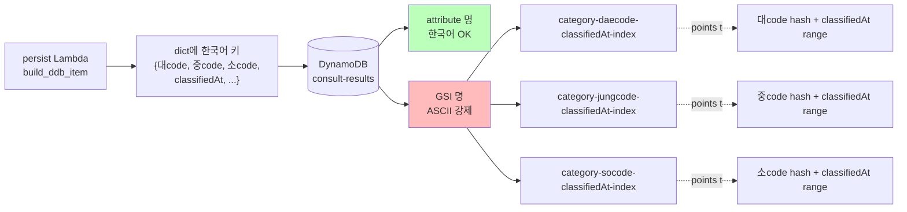
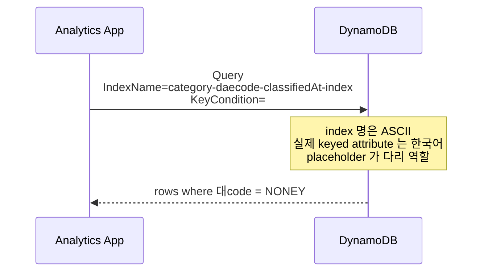

# ADR-008: 한국어 DDB 속성명 허용 + ASCII GSI index 명 강제

- **Status**: Accepted
- **Date**: 2026-05-22 (재문서화 2026-05-27)
- **Affects**: `infra/modules/storage/main.tf`, `src/lib/persistence.py`, `src/lambdas/persist/handler.py`

## Context

DDB 의 `consult-results` 테이블이 분류 결과를 저장. 자연스러운 attribute 명:
- `category_대code` (대분류 코드)
- `category_중code` (중분류 코드)
- `category_소code` (소분류 코드)
- `classifiedAt` (분류 시각)
- `callId`, `confidence`, `reason` 등

분석팀 / 운영팀이 DDB 콘솔에서 직접 조회 시 한국어 속성명이 도메인 의미를 즉시 전달. 영문 음역 (`daecode`, `jungcode`) 보다 가독성 압도적.

**핵심 제약**: DynamoDB GSI **index 명** 은 `[a-zA-Z0-9_.-]{3,255}` 패턴만 허용 (AWS API constraint). attribute 명은 unicode 허용. 즉:

- ✅ attribute name = `category_대code` (한국어 OK)
- ❌ index name = `category-대code-classifiedAt-index` (한국어 reject)

초기 안: index 명도 한국어로 → Terraform plan 단계에서 API validation 실패.

## Decision

**Attribute 명** 은 한국어 허용 (`category_대code`, `category_중code`, `category_소code`). **GSI index 명** 은 ASCII 음역 (romanization) 사용.

음역 규칙:
- `대` → `daecode` (대분류)
- `중` → `jungcode` (중분류)
- `소` → `socode` (소분류)

GSI 명명:
- `category-daecode-classifiedAt-index` — `category_대code` hash + `classifiedAt` range
- `category-jungcode-classifiedAt-index` — `category_중code` hash + `classifiedAt` range
- `category-socode-classifiedAt-index` — `category_소code` hash + `classifiedAt` range

Persistence 코드 (`src/lib/persistence.py`):
- `build_ddb_item()` 가 `category_대code` / `category_중code` / `category_소code` 키로 dict 구성
- DDB query 시 `IndexName="category-daecode-classifiedAt-index"`, `KeyConditionExpression` 안의 attribute 명은 `#daecode` placeholder → `ExpressionAttributeNames={"#daecode": "category_대code"}` 매핑

## Architecture Flow

### Query 시 placeholder 매핑

## Consequences

### Positive
- DDB 콘솔 / boto3 응답 dict 에서 한국어 키가 도메인 의미를 즉시 전달
- 분석팀 / 운영팀 onboarding 시 attribute 명 학습 비용 0
- GSI index 명은 AWS API 제약을 만족 — Terraform plan 통과
- 음역 규칙이 명확 (`대→daecode`) — 일관성 유지

### Negative
- Query / Scan 시 ExpressionAttributeNames placeholder 필수 — 코드 약간 verbose. 그러나 boto3 표준 패턴.
- Index 명과 attribute 명의 불일치가 신규 합류자에게 혼란 가능 — 본 ADR 로 명문화.
- 음역 규칙 변경 시 (예: `대` → `dae` 로 단축) GSI 명 변경 = DDB GSI 재생성 (downtime + 데이터 reindex). 변경 자제.

### Neutral
- 한국어 attribute 명이 IAM policy 의 `dynamodb:Attributes` condition 에서도 사용 가능 (한국어 OK).
- DDB streams 의 `NEW_AND_OLD_IMAGES` payload 도 한국어 키 그대로 — downstream consumer 가 한국어 처리 가능해야 (UTF-8).

## Alternatives Considered

### Option A: 모든 attribute 명을 영문으로 (`daecode`, `jungcode`)
운영팀 가독성 손실. xlsx 의 한국어 라벨과 분리 — 도메인 mismatch. 거부.

### Option B: 모든 attribute 명을 한국어로 + GSI 명도 한국어
AWS API constraint 위반. 거부.

### Option C: GSI 명에 한국어 음역 대신 일련 번호 (`gsi-1`, `gsi-2`, `gsi-3`)
이름에서 인덱스 의미 추론 불가. 거부.

### Option D: GSI 명에 attribute 명을 base64 인코딩
가독성 0. 거부.

## Implementation Notes

- `infra/modules/storage/main.tf` — `aws_dynamodb_table.consult_results` 의 `attribute` 블록에 한국어 name 사용. `global_secondary_index.name` 은 ASCII 음역.
- `src/lib/persistence.py:build_ddb_item` — Python dict 키로 한국어 문자열 사용 (Python 3.12 unicode OK)
- 신규 query 시 항상 `ExpressionAttributeNames` 로 placeholder 매핑
- 회귀 테스트: `tests/unit/test_persistence.py::test_build_ddb_item_has_all_required_fields` (한국어 키 `category_대code`/`category_중code`/`category_소code` assert)
- 문서 sync 가이드: 본 ADR + `infra/CLAUDE.md` DynamoDB 섹션 + 설계 spec §3.4 가 동일 음역 규칙 명시

## References

- 관련 코드: `infra/modules/storage/main.tf` (gsi3 = `category-daecode-classifiedAt-index`), `src/lib/persistence.py:build_ddb_item`
- AWS docs: [DynamoDB naming rules](https://docs.aws.amazon.com/amazondynamodb/latest/developerguide/HowItWorks.NamingRulesDataTypes.html)
- 관련 spec: §3.4 (DDB 스키마)
