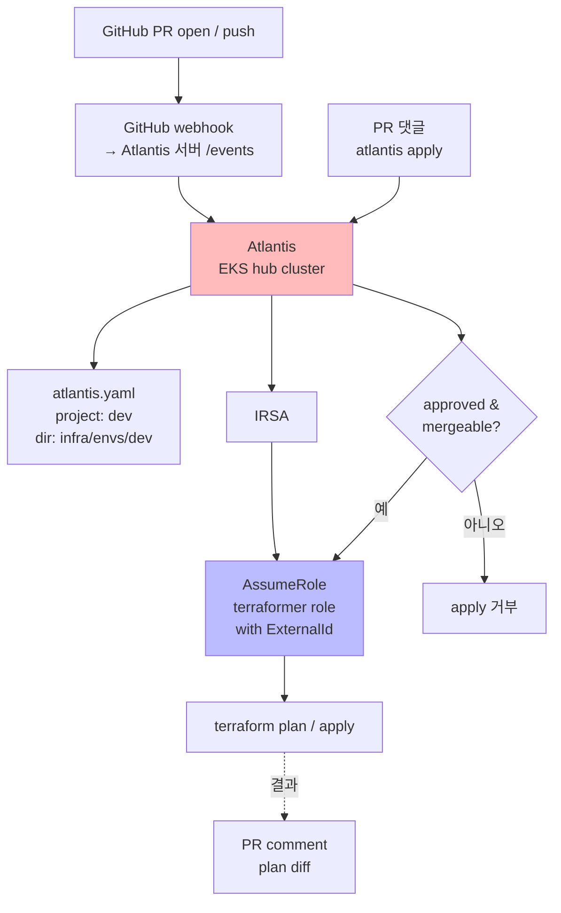
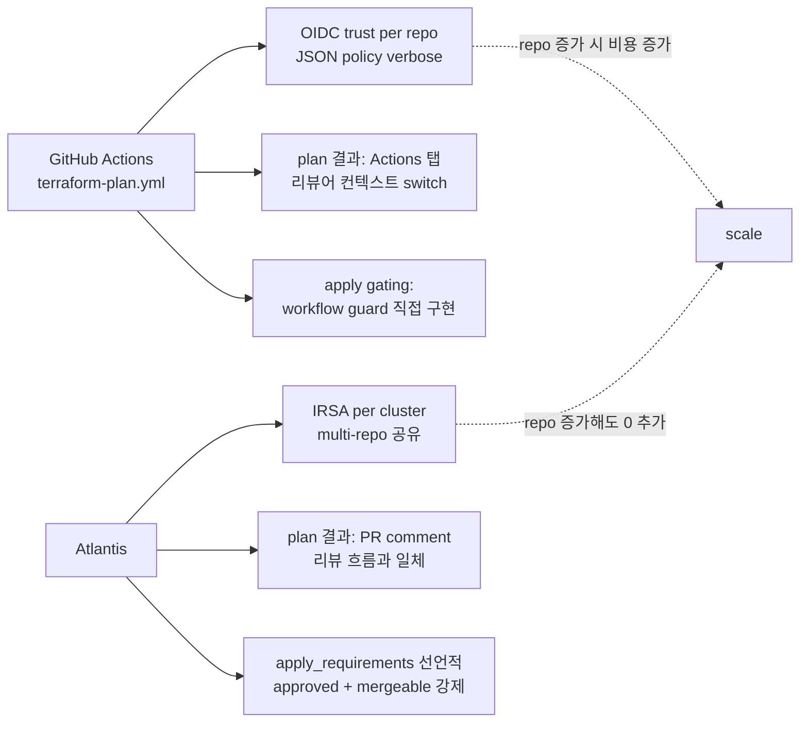

# ADR-009: Atlantis 로 Terraform plan/apply 처리 (GitHub Actions 대신)

- **Status**: Accepted
- **Date**: 2026-05-22 (재문서화 2026-05-27)
- **Affects**: `.github/workflows/`, `atlantis.yaml`, `docs/operations/atlantis-setup.md`

## Context

Phase 1 초기 안 (PR1~PR5) 은 GitHub Actions 의 `terraform-plan.yml` / `terraform-apply.yml` workflow 로 Terraform 을 운영. 문제점:

1. **OIDC role 관리** — 각 workflow 가 AssumeRole 위해 OIDC trust policy 설정 필요. multi-account / cross-region 시 trust 정책 verbose.
2. **plan 결과 가시성** — Actions 로그가 PR comment 와 분리되어 reviewer 가 두 곳 확인
3. **Apply gating** — 누가 언제 apply 권한 행사하는지 audit 까다로움
4. **다중 프로젝트 통합** — 본 repo + 동일 조직의 다른 repo 들이 Terraform 운영 시 GitHub Actions 별도 설정 중복

조직에 이미 `<INFRA_REPO>` repo 의 EKS hub cluster 에 **Atlantis** 가 설치되어 다른 프로젝트들의 Terraform 을 처리. 본 repo 도 합류 시 운영 통일.

## Decision

Terraform plan/apply 는 **Atlantis** 가 처리. `.github/workflows/terraform-{plan,apply}.yml` 은 제거. 본 repo 에 `atlantis.yaml` (v3 schema) 추가하여 project mapping.

**GitHub Actions 잔존 workflow** (Atlantis 가 cover 못 하는 영역):
- `ci.yml` — pytest + ruff + mypy + terraform fmt/validate (정적 검사 only)
- `pr-review.yml` — Bedrock Claude PR 자동 리뷰

**Atlantis 구성**:
- IRSA: `<ATLANTIS_IRSA_ROLE>` (EKS service account → IAM role)
- AssumeRole 체인: Atlantis IRSA → 전용 terraformer role with `ExternalId` (계정/role 명은 terraform.tfvars 로 주입)
- 명령: PR 댓글 `atlantis plan` / `atlantis apply`
- `apply_requirements: [approved, mergeable]` — 승인된 PR 만 apply
- `automerge: false` — apply 후 자동 merge 안 함 (사람이 merge)

## Architecture Flow

### GitHub Actions vs Atlantis trade-off

## Consequences

### Positive
- plan 결과가 PR comment 로 inline — 리뷰어 경험 통일
- apply gating 이 `atlantis.yaml` 에 선언적 — `approved + mergeable` 미충족 시 자동 reject
- IRSA 1회 구성으로 multi-repo 재사용 — 조직 내 신규 Terraform repo 합류 비용 ↓
- AssumeRole 체인 + ExternalId 로 cross-account 보안 강화
- Atlantis logs 가 audit trail (누가 언제 apply)

### Negative
- Atlantis cluster 자체가 SPOF — `<INFRA_REPO>` 운영팀 의존성. cluster 장애 시 모든 repo terraform 정지.
- 신규 Lambda / IAM policy 추가 시 Atlantis IRSA → Terraformer role 의 IAM permission 검토 필요. (실제 인시던트: ADR 작성 시점에 PR #10 의 AI Code Review 가 Bedrock `inference-profile/global.anthropic.claude-opus-4-*` ARN 권한 누락으로 일시 실패 — 권한 추가 후 정상.)
- 디버그 시 Atlantis pod logs 접근 필요 — `kubectl logs` 권한 별도 운영팀에.

### Neutral
- `tests/structure/test-github-actions.sh` 가 `terraform-{plan,apply}.yml` 가 존재하지 않음을 부정 검증 (regression 가드)
- `atlantis.yaml` 의 schema v3 강제
- Self-hosted runner (claude-arm) 는 `pr-review.yml` 만 사용 — Atlantis 는 hub cluster 안에서 실행

## Alternatives Considered

### Option A: GitHub Actions terraform workflows 유지
OIDC trust 관리 비용 + plan 가시성 손실. 다른 repo 와 운영 분기. 거부.

### Option B: Terraform Cloud (HCP)
SaaS 비용 + KakaoPay 내부 보안 정책상 외부 SaaS 사용 추가 검토 필요. 거부.

### Option C: Spacelift / Env0
SaaS, 위와 동일. 거부.

### Option D: 자체 ArgoCD-style GitOps (Terraform Atlantis fork)
운영 부담. Atlantis 가 이미 organization 표준 — fork 동기 미흡.

## Implementation Notes

- `atlantis.yaml` (v3) — `projects` 에 `dir: infra/envs/dev` 매핑. `apply_requirements: [approved, mergeable]`. `automerge: false`.
- IRSA role: `<ATLANTIS_IRSA_ROLE>` in EKS hub cluster, trust policy `pod-identity-association`
- AssumeRole target: `var.terraformer_role_arn` (각 env 의 terraform.tfvars 로 주입, git-ignored)
- GitHub App / webhook: 운영 서버 설정 (값은 비공개)
- docs: `docs/operations/atlantis-setup.md` 가 setup 절차 + apply 명령 + IAM 체인 명시
- 회귀 가드: `tests/structure/test-github-actions.sh` 가 `terraform-{plan,apply}.yml` 부재 + `atlantis.yaml` 존재 검증

## References

- 관련 코드: `atlantis.yaml`, `infra/envs/dev/variables.tf` (terraformer_role_arn)
- 운영 docs: `docs/operations/atlantis-setup.md`, `docs/operations/github-actions-setup.md`
- Atlantis docs: [Atlantis](https://www.runatlantis.io/)
- 관련 spec: §6 (배포 / 운영)
