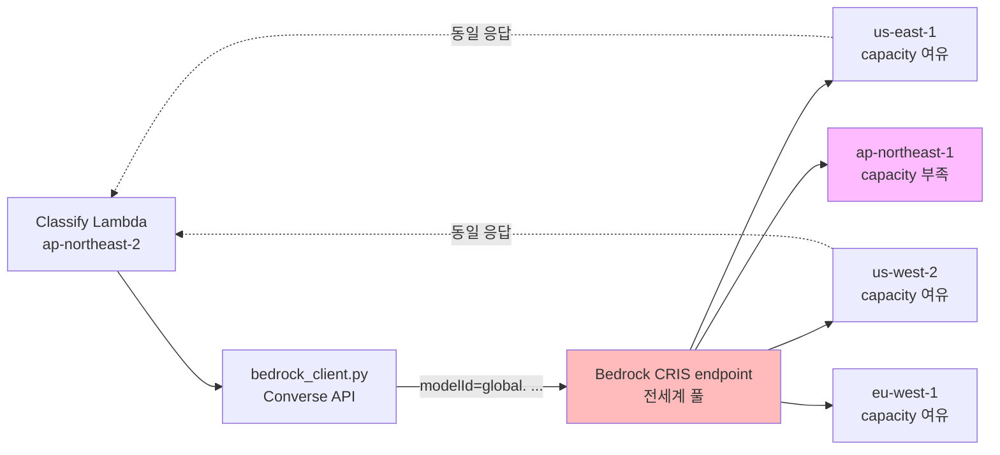
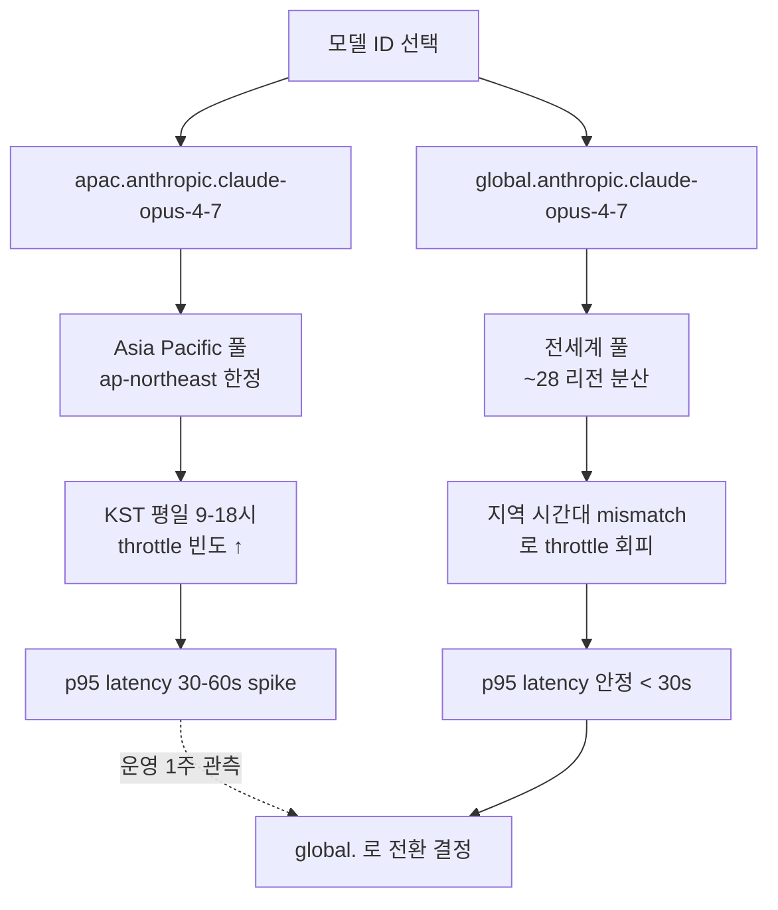

# ADR-010: `global.` Bedrock CRIS (cross-region inference profile)

- **Status**: Accepted
- **Date**: 2026-05-22 (재문서화 2026-05-27)
- **Affects**: `src/lib/bedrock_client.py`, `src/lambdas/classify/handler.py`, `src/lambdas/verify/handler.py`, `.github/workflows/pr-review.yml`

## Context

Anthropic Claude 모델을 Bedrock 으로 호출 시 모델 식별자 선택 옵션:

1. **Region-specific model ID** — 예: `us-east-1.anthropic.claude-opus-4-7`. 단일 리전 고정.
2. **Region-pinned CRIS** — 예: `apac.anthropic.claude-opus-4-7` (Asia Pacific 풀). 지역 풀 안에서 capacity 분산.
3. **Global CRIS** — 예: `global.anthropic.claude-opus-4-7` (전세계 풀). 모든 리전 capacity 분산.

본 시스템 요구사항:
- p95 < 30s 안에 분류 완료 — capacity 가 한 리전에 모이면 throttle 시 latency spike
- 분당 수십~수백 건 처리 — Bedrock RPM 한도 도달 가능
- KakaoPay 가 한국에 위치하지만 Bedrock Asia Pacific 풀이 Opus 4.7 모든 시간대 충분한 capacity 보장하지 않음

Phase 1 PR1~PR5 초기 코드는 `apac.` CRIS 사용 → 운영 1주 후 throttle 빈도 관측 → `global.` 로 전환.

## Decision

Bedrock 호출 시 **global CRIS** 사용:
- `global.anthropic.claude-opus-4-7` (Classify Lambda) — production. Opus 4.8 로의 bump 는 별도 ADR + 골든셋 회귀 평가 후 진행.
- `global.anthropic.claude-sonnet-4-6` (Verify Lambda)
- `global.anthropic.claude-opus-4-8` (`.github/workflows/pr-review.yml` AI Code Review — PR #22 에서 4.7 → 4.8 bump. PR Review 는 production 트래픽이 아니라 doc 검토용이라 골든셋 회귀 검증 불필요.)

IAM 권한:
- Lambda execution role 에 `bedrock:InvokeModel` 의 `Resource` 에 inference-profile ARN 명시:
  - `arn:aws:bedrock:*::foundation-model/anthropic.claude-opus-4-7-*`
  - `arn:aws:bedrock:*::inference-profile/global.anthropic.claude-opus-4-*`
  - 동일 패턴 sonnet-4-6
- 와일드카드 region 사용 (`*`) — global CRIS 가 어느 리전으로 라우팅할지 사전 결정 불가

## Architecture Flow

### apac vs global CRIS 비교

## Consequences

### Positive
- Throttle 빈도 ↓ — 한 리전 capacity 부족 시 다른 리전으로 라우팅
- p95 latency 안정화 (< 30s 목표 유지)
- 신규 리전 출시 시 Anthropic 가 자동으로 global pool 에 추가 → 코드 변경 0

### Negative
- 데이터가 사용자 region (ap-northeast-2 가정) 밖으로 ephemeral 전송 — 데이터 거주성 (data residency) 정책 검토 필요. KakaoPay 의 경우 STT 본문은 이미 PII 마스킹 후 Bedrock 으로 송신 (ADR-003 참조) → 마스킹된 본문의 cross-region inference 는 허용 범위로 판단.
- Bedrock 요금이 라우팅된 리전 기준 — 리전마다 단가 변동 가능 (현재는 동일).
- CloudTrail / KMS audit log 에서 호출 리전이 동적 — 로그 분석 시 multi-region 고려 필요.

### Neutral
- IAM policy 의 region wildcard (`*`) 가 보안 검토 대상이지만, `Resource` 의 model/inference-profile prefix 가 충분히 좁아 위험 낮음.
- Anthropic 가 향후 global pool 의 routing 정책 변경 시 별도 검토 필요.

## Alternatives Considered

### Option A: region-specific model ID (`us-east-1.anthropic.claude-opus-4-7`)
- KakaoPay → us-east-1 cross-region 비용 + latency
- 단일 리전 capacity 풀 — Opus throttle 시 fallback 없음
- 거부.

### Option B: apac CRIS 유지
- Asia Pacific 풀이 평일 9-18시 KST throttle 빈도 ↑ 관측 (운영 1주)
- p95 latency spike
- 거부.

### Option C: 자체 region fallback (apac → us-east-1 → us-west-2 sequential)
- Lambda 코드에 retry/fallback 로직 직접 구현
- CRIS 가 같은 일을 managed 로 제공 — 자체 구현은 reinvent
- 거부.

## Implementation Notes

- `src/lib/bedrock_client.py` — 환경변수 `BEDROCK_MODEL_ID_OPUS` / `BEDROCK_MODEL_ID_SONNET` 로 model ID 주입. default `global.anthropic.claude-opus-4-7` / `global.anthropic.claude-sonnet-4-6`.
- `infra/modules/classify-pipeline/iam.tf` — Lambda role 의 bedrock:InvokeModel 권한에 inference-profile ARN 패턴 추가
- `.github/workflows/pr-review.yml` — `ANTHROPIC_MODEL` env 가 `global.anthropic.claude-opus-4-8` (PR #22 머지). production classify/verify Lambda 의 model ID 와 의도적으로 분기 — PR Review 는 자체 트래픽이라 별도 evaluation gate 없이 신규 모델 적용 가능.
- `tests/structure/test-github-actions.sh` 가 `global.anthropic.claude-opus-4-7` 문자열 grep 검증
- 회귀 인시던트 기록: PR #10 시점에 Atlantis IRSA 가 `inference-profile/global.anthropic.claude-opus-4-*` ARN 권한 누락으로 AI Code Review 일시 실패 — IAM 권한 추가 후 정상화. ADR-009 도 동일 인시던트 참조.

## References

- 관련 코드: `src/lib/bedrock_client.py`, `infra/modules/classify-pipeline/iam.tf` (bedrock 권한), `.github/workflows/pr-review.yml`
- AWS docs: [Cross-region inference profiles](https://docs.aws.amazon.com/bedrock/latest/userguide/cross-region-inference.html)
- 관련 spec: §3.5 (Bedrock 통합), §7.4 (보안 / IAM)
- 관련 ADR: [[ADR-009-atlantis-for-terraform-deployment]] (Atlantis IRSA 권한 인시던트)
