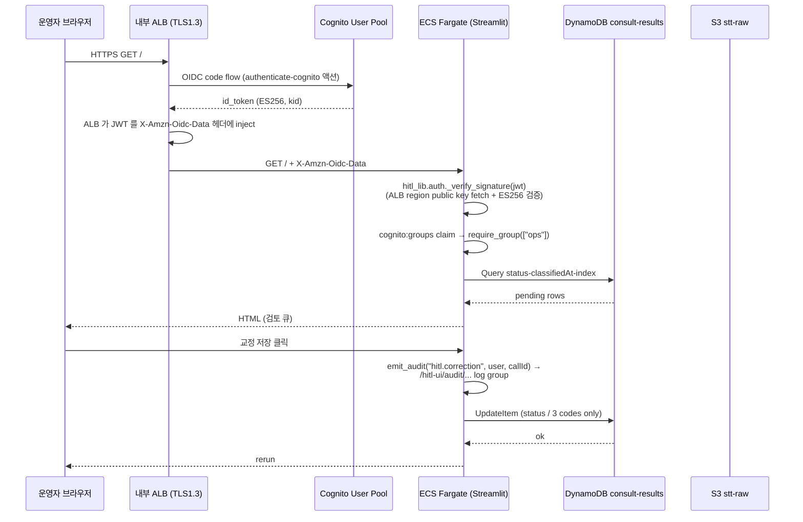
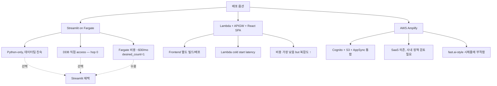

# ADR-011: HITL UI 를 Streamlit on Fargate 로 배포

- **Status**: Accepted
- **Date**: 2026-05-28
- **Deciders**: project owner
- **Affects**: `src/hitl_ui/`, `infra/modules/hitl-ui/`

## Context

PR8 의 HITL UI 는 운영팀 검토 + 분석팀 검색 + 컴플라이언스 감사용 사내 인트라넷 UI. 분류 결과를 DDB 에서 조회 / 교정 / 다운로드. 트래픽은 운영팀 인원 ~20 명, 동시 접속 ~5 명. 사내 SSO 가 Cognito 기반.

배포 형태로 다음 옵션 비교:

1. **Streamlit on Fargate** (채택)
2. Lambda + API Gateway + React SPA
3. AWS Amplify (Cognito + S3 static + AppSync)

추가 trade-off:
- ALB 의 `authenticate-cognito` 액션 vs 앱-레벨 OAuth2
- `hitl_lib` naming (root `src/lib/` 와의 충돌 회피)

## Decision

**Streamlit on Fargate + 내부 ALB + authenticate-cognito**.

근거:
- 분석팀 / 운영팀이 가장 빠르게 시제품 검증 가능 (Streamlit = Python only, 데이터 / 분류 코드와 같은 언어)
- DDB 직접 query → Lambda+APIGW 사이 hop 0 → 검토 큐 페이지 응답 < 1s
- ALB authenticate-cognito 가 OIDC flow 를 인프라 레벨에서 처리 → 앱 코드는 ALB-주입 헤더만 검증

추가 결정:
- **ALB authenticate-cognito**: 앱 코드의 OAuth 구현 0 → 보안 수면 ↓. ALB 가 ES256 JWT 를 헤더 주입, 앱은 검증만 (ADR-011 + AI 리뷰 M2).
- **hitl_lib 명명**: 루트 `src/lib/` (Lambda 공유 모듈) 와 동일 이름 사용 시 `pytest` collection 단계에서 모듈 충돌. `hitl_lib` 로 분리 — Dockerfile 의 PYTHONPATH 도 일관 (M1 의 inline 코멘트 + AI 리뷰 m1 권고).

## Architecture Flow

### 배포 옵션 비교

## Consequences

### Positive
- 시제품 → 운영 까지 같은 언어 / 같은 dependency (boto3, pydantic)
- DDB 직접 query 로 latency 우수
- ALB authenticate-cognito 가 OAuth code flow 처리 → 앱 보안 표면적 ↓
- emit_audit 모듈이 PR9 observability dashboard 와 자연스럽게 통합 가능 (별도 메트릭 추가 trivial)

### Negative
- Streamlit 의 multi-user 동시 작업 시 lock 부재 — `update_correction` 의 마지막 write wins. 동시 작업 흔치 않다 가정. Phase 2 에서 DDB ConditionExpression 추가 검토.
- Streamlit rerun on button — soft polling pattern 으로 인한 DDB read 비용 증가 가능 (per-user 5-10 query / 분 추정).
- 컨테이너 이미지 빌드 / push 가 Lambda 패키징보다 무거움. PR10 CI/CD 에서 SHA-pinned image_tag 변수로 IMMUTABLE 보장 (ADR-005 와 다른 패턴 — Lambda staging-dir 미사용).
- ALB authenticate-cognito 의 JWT 가 ES256. `_verify_signature` 가 ALB region public key fetch — 첫 호출 latency ↑ (10s 정도 cache 후 해소).

### Neutral
- hitl_lib 명명이 root lib 와 분리. Dockerfile PYTHONPATH 가 `/app/hitl_ui:/app` 으로 둘 다 노출.
- Cognito user 생성은 모듈에서 안 함 (ADR-009 — 운영팀 절차로 처리)

## Alternatives Considered

### Option B — Lambda + API Gateway + React SPA
**거부 이유**:
- Frontend 별도 build pipeline 필요 (CRA / Vite / Next.js 선택 + S3 + CloudFront)
- Lambda cold start latency 가 운영 UI 체감 (분류 큐 페이지 첫 진입 200-500ms 지연)
- 분석팀 / 운영팀이 Python 우선 — React 가 학습 부담
- 결과적으로 시제품 단계의 가치 손실 > 운영 단계의 비용 절감

### Option C — AWS Amplify
**거부 이유**:
- SaaS 추가 의존 (사내 보안 정책 검토 trigger)
- AppSync GraphQL → DDB 매핑이 한국어 attribute 명에 대한 별도 처리 필요 (ADR-008)
- 시제품 검증 빠른 iteration 에 비적합

### Option D — 앱 레벨 OAuth2 (ALB pass-through)
**거부 이유**:
- 앱 코드에 OAuth code flow / token refresh / session store 모두 구현 필요
- 보안 표면적 ↑ — 검증되지 않은 토큰 핸들링 위험
- 사내 SSO 표준이 ALB authenticate-cognito 의 OIDC 헤더 기반

## Implementation Notes

- `infra/modules/hitl-ui/main.tf`:
  - `aws_lb_listener.https` 의 `default_action.type = "authenticate-cognito"` — ALB 가 OAuth flow 실행
  - `aws_ecr_repository.hitl` 의 `image_tag_mutability = "IMMUTABLE"` — tag hijack 방지 (G8)
  - `aws_cloudwatch_log_group.hitl_audit` — Cognito user → action trail 별도 retention 365d
- `src/hitl_ui/hitl_lib/auth.py`:
  - `_verify_signature(jwt)` — ALB region public key fetch + ES256 검증
  - `LOCAL_DEV=1` escape 는 unit test / 개발 환경 한정 — prd 빌드 시 환경변수 미설정
- `src/hitl_ui/Dockerfile`:
  - `PYTHONPATH=/app/hitl_ui:/app` — hitl_lib + (project) lib 동시 노출
  - PyJWT[crypto] 의존성으로 cryptography 자동 install

## References

- 관련 spec: `docs/superpowers/specs/2026-05-27-hitl-ui-design.md`
- 관련 ADR: [[ADR-005-per-lambda-staging-dir-packaging]] (ECS 와 패키징 패턴이 다른 이유), [[ADR-006-kms-data-class-separation]] (KMS scope), [[ADR-009-atlantis-for-terraform-deployment]] (user out-of-band)
- AWS docs: [ALB authenticate-cognito](https://docs.aws.amazon.com/elasticloadbalancing/latest/application/listener-authenticate-users.html)
- AI Code Review PR #14 (`<!-- callcenter-pr-review -->` comment, 2026-05-27)
