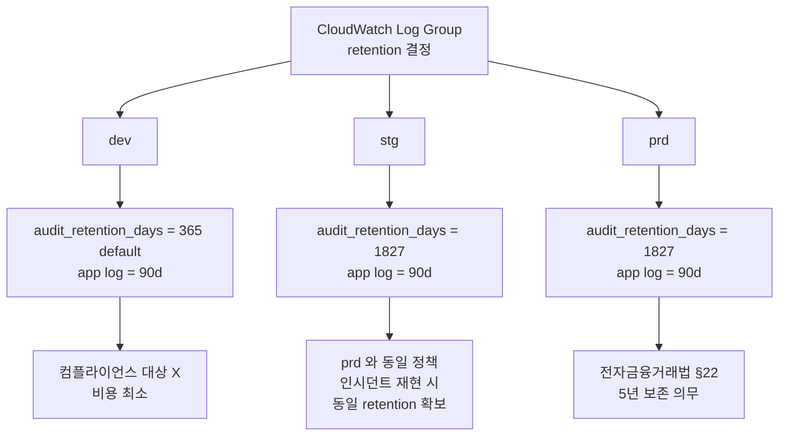

# ADR-012: HITL 감사 로그 5년 보존 (전자금융거래법 §22)

- **Status**: Accepted
- **Date**: 2026-05-28
- **Deciders**: project owner
- **Affects**: `infra/envs/{stg,prd}/main.tf`, `infra/modules/hitl-ui/`

## Context

PR #14 (HITL UI) 가 도입한 `/hitl-ui/audit/...` CloudWatch log group 은 다음 이벤트를 기록한다:

- `hitl.correction` — 운영자가 분류를 교정한 기록 (user / callId / 대code)
- `hitl.skip` — 운영자가 검토를 스킵한 기록 (user / callId)
- `compliance.presigned_url` — 컴플라이언스 사용자가 원본 STT 다운로드용 presigned URL 을 발급받은 기록 (user / callId / s3_uri)

`infra/modules/hitl-ui/variables.tf` 의 `audit_retention_days` default 는 **365일**. 1차 AI 리뷰 (PR #16) 가 이 default 가 KakaoPay 의 컴플라이언스 요건을 충족하지 못한다고 지적.

**컴플라이언스 근거**:
- **전자금융거래법 §22 (전자금융거래기록 보존)**: 전자금융업자는 전자금융거래기록을 **5년**간 보존해야 한다.
- KakaoPay 가 전자금융업 등록 사업자이므로 본 시스템의 HITL 정정 / 컴플라이언스 다운로드는 "전자금융거래기록" 의 부수 기록으로 해석 가능. 보수적으로 동일 보존 기간 적용.

## Decision

`audit_retention_days` 를 **환경별** 명시적 override 로 분기:

| env | audit_retention_days | 근거 |
|---|---|---|
| dev | 365 (module default) | 비용 절감, 컴플라이언스 대상 X |
| stg | 1827 (5년) | prd 와 운영 정책 일관 — stg 에서 reproduce 한 인시던트가 prd 와 동일 retention 으로 회수 가능 |
| prd | 1827 (5년) | 전자금융거래법 §22 |

application log group (`/ecs/callcenter-{env}-hitl`) 은 별도 변수 `log_retention_days` (default 90d) 로 분리되어 영향 없음 — 비용 trade-off 의 핵심 부분.

## Architecture Flow

```mermaid
flowchart LR
    User[운영자 / 컴플라이언스] --> UI[Streamlit HITL UI]
    UI --> Audit[hitl_lib.audit.emit_audit]
    Audit --> LG[/hitl-ui/audit/callcenter-prd<br/>CloudWatch Log Group<br/>retention=1827d]
    LG -.5년 보존.-> Compliance[전자금융거래법 §22<br/>감사 / 검사 대응]

    UI --> AppLog[Streamlit stdout]
    AppLog --> App[/ecs/callcenter-prd-hitl<br/>retention=90d]
    App -.90d.-> Trash[자동 삭제]

    style LG fill:#fbb
    style Compliance fill:#bfb
    style App fill:#bbf
```

### 보존 정책의 환경별 분기



## Consequences

### Positive
- 전자금융거래법 §22 의 5년 보존 의무 명시적 충족
- stg / prd 정책 일관 — stg 에서 재현된 인시던트의 audit trail 이 prd 인시던트와 동일 retention 으로 회수 가능
- dev 는 비용 효율 유지 (분류 결과 자체는 DDB TTL 1y 로 별도 정책)
- app log retention (90d) 과 audit log retention (1827d) 가 분리되어 비용 최소 + 의무 충족 양립

### Negative
- CloudWatch Logs 비용 ↑: audit log 가 5년치 누적. 추정 일 record 수 = 운영팀 5명 × 100건/day = 500 events × ~200B/event = 100KB/day × 365 ≈ 36.5MB/년 × 5년 ≈ **183MB**. 비용 영향 미미 (월 $0.01 미만, S3 export 없이 CW Logs 보관 기준).
- prd / stg 의 retention 변경 시 module 내부 default 가 아닌 env 별 override 라 변경 시 두 곳 동시 수정 필요. 본 ADR 로 변경 이력 명시.

### Neutral
- analytics S3 데이터 (Parquet) 의 retention 은 별도 (analytics 모듈의 lifecycle rule). 본 ADR 은 audit log 에 한정.
- 5년 후 자동 삭제 시 외부 archive (S3 Glacier Deep Archive 등) 로 이관 정책은 Phase 2 에서 별도 검토.

## Alternatives Considered

### Option A: module default 를 1827 로 변경
모든 env (dev 포함) 가 5년 retention → dev 비용 ↑. 컴플라이언스 대상 아닌 dev 에 불필요한 비용 부담. 거부.

### Option B: dev 에도 5년 적용
spec §2.2 의 prd hardening 와 일치 안 함. 비용 정책 불일관. 거부.

### Option C: S3 + Lifecycle 로 audit log 이관 (5년 후 Glacier Deep Archive)
CloudWatch Logs → S3 Export 가 별도 운영. Phase 2 에서 retention 비용이 임계 도달 시 검토. 본 ADR 범위 외.

### Option D: 외부 SIEM 에 ingest (Splunk / Datadog)
사내 보안 정책 검토 trigger. 컴플라이언스 회계감사 시 evidence 제공 어려움. 거부.

## Implementation Notes

- `infra/envs/stg/main.tf` + `infra/envs/prd/main.tf` 의 `module "hitl_ui"` 블록에 `audit_retention_days = 1827` 명시.
- `infra/envs/dev/main.tf` 는 명시 안 함 (module default 365d 유지).
- `infra/modules/hitl-ui/variables.tf` 의 default 는 그대로 365 유지 — 보수적 default 보다 명시적 override 가 더 추적 가능.
- 회귀 가드 (자동화 완료, PR #16): `tests/integration/test_env_layout.py::test_audit_retention_5y_in_stg_prd` 가 stg/prd 각각의 `main.tf` 의 `module "hitl_ui"` 블록에서 `audit_retention_days = 1827` override 를 정규식으로 검증한다 (`@pytest.mark.parametrize("env", ("stg", "prd"))` — 두 env 모두 강제). override 가 사라지면 `terraform plan` drift 감지에 더해 CI `pytest` 단계에서 즉시 fail. (이전 "plan 의존" 상태에서 자동 가드로 격상.)

## References

- 관련 코드: `infra/envs/{stg,prd}/main.tf:hitl_ui` 블록, `infra/modules/hitl-ui/variables.tf:audit_retention_days`
- 관련 ADR: [[ADR-011-hitl-ui-streamlit-on-fargate]] (audit log group 의도), [[ADR-006-kms-data-class-separation]]
- 전자금융거래법: 제22조 (전자금융거래기록의 생성·보존 및 파기)
- AI Code Review on PR #16, 2026-05-28
