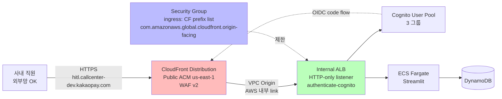
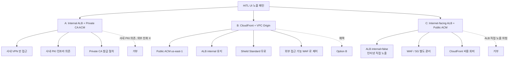

# ADR-013: HITL UI 를 CloudFront + VPC Origin 으로 fronting

- **Status**: Accepted
- **Date**: 2026-05-30
- **Deciders**: project owner
- **Affects**: `infra/modules/hitl-ui/`, `infra/envs/{dev,stg,prd}/main.tf`
- **Supersedes (부분)**: [[ADR-011-hitl-ui-streamlit-on-fargate]] 의 "ALB 가 ACM 인증서를 직접 들고 사내 인트라넷 도메인을 fronting" 부분만 (Cognito / ECS / Streamlit 결정은 유지).

## Context

ADR-011 의 원래 설계는 **Internal ALB + 사내 PKI ACM**:
- ALB internal=true, 사내 VPN 접근만 허용
- ACM 인증서 도메인 `hitl.callcenter-{env}.kakaopay.internal` (사내 사설 도메인)
- 인증서는 사내 **Private CA**(`acm-pca`) 발급 필요

문제점:
1. **Public ACM 사용 불가** — `.internal` 같은 사설 도메인은 public CA 가 검증 불가. AWS Private CA 인프라(사내 PKI) 의존.
2. **외부 접근 불가** — 사내 직원이 VPN 통해서만 접근. 외근 / 재택 운영팀 access friction.
3. **WAF 비통합** — ALB WAF 은 별도 설정 필요. Shield Standard 무료 보호 활용 불가.

CloudFront 의 **VPC Origin** 기능이 2024-11 GA. CloudFront 가 private ALB 를 origin 으로 사용 가능 — private VPC link 통한 직접 통신. ALB 를 인터넷 노출 없이 CloudFront fronting 가능.

## Decision

**CloudFront distribution + VPC Origin → Private ALB** 패턴으로 전환.

| 레이어 | 역할 | 인증서 |
|---|---|---|
| CloudFront | Edge TLS termination + 사용자 facing | Public ACM (us-east-1, 공개 도메인 `hitl.callcenter-{env}.kakaopay.com`) |
| VPC Origin | CloudFront ↔ ALB 사이 VPC link | (없음 — AWS 내부 link) |
| Internal ALB | authenticate-cognito + target group → ECS | HTTP-only listener (CloudFront 가 TLS 종료) |
| ECS Fargate | Streamlit 컨테이너 | (없음) |

세부 변경:
- Public ACM 인증서는 CloudFront 전용으로 **us-east-1** 에 발급 (CloudFront 의 ACM region 제약)
- ALB HTTPS listener 의 cert 의존 제거 → HTTP listener (port 80) 로 단순화
- ALB SG ingress: **CloudFront managed prefix list** `com.amazonaws.global.cloudfront.origin-facing` 만 허용 (VPC Origin 경로) — 인터넷 직접 노출 0
- WAF v2 web ACL (CloudFront scope, us-east-1) — Managed rules: AWSManagedRulesCommonRuleSet, AWSManagedRulesKnownBadInputsRuleSet
- Cognito authenticate-cognito 는 ALB 에 그대로 — CloudFront 는 OIDC 헤더 / 쿠키를 passthrough

## Architecture Flow

### 배포 패턴 비교

## Consequences

### Positive
- **Public ACM 사용** — 사내 PKI 인프라 없이도 발급 가능. ACM 자동 갱신.
- **외부 접근** — 사내 직원이 VPN 없이 외근/재택에서도 access. CloudFront 의 geo-restriction 또는 WAF rule 로 사내 IP 제한 가능.
- **WAF + Shield Standard** — DDoS / SQLi / XSS 자동 보호 (무료 tier).
- **ALB internal 유지** — 직접 인터넷 노출 0. CloudFront prefix list 외 ingress 거부.
- **CloudFront 캐시** — Streamlit 정적 자원 (CSS/JS) 캐시 → ALB / ECS 부하 ↓.

### Negative
- **CloudFront 비용** — distribution ~$0/mo + traffic. 운영팀 5명 × 10MB/day × 30일 = 1.5GB/월 ≈ $0.13/월. 무시 가능.
- **us-east-1 provider alias 필요** — Terraform multi-region. ACM (CloudFront) 와 WAF v2 (CloudFront scope) 가 모두 us-east-1 강제.
- **TLS termination at CloudFront** — CloudFront ↔ ALB 사이 HTTP. AWS 내부 VPC link 라 인터넷 노출 X, 다만 layered TLS 가 아닌 단일 termination. 보안 검토에서 명시.
- **OIDC code flow latency ↑** — CloudFront 통해 ALB authenticate-cognito → Cognito redirect → CloudFront 재진입. p95 약 200ms 추가 가능.

### Neutral
- ADR-011 의 Cognito + Streamlit + ECS Fargate 결정은 그대로 유지.
- ADR-012 의 audit log group 5년 보존 영향 없음.
- Cognito callback URL 이 CloudFront 도메인으로 변경 — `https://hitl.callcenter-{env}.kakaopay.com/oauth2/idpresponse`.

## Alternatives Considered

### Option A — Internal ALB + Private CA ACM (이전 설계)
- 거부: 사내 PKI 인프라 의존 + 외부 접근 friction
- 채택했었으나 본 ADR 로 부분 superseded

### Option C — Internet-facing ALB + Public ACM
- ALB internal=false → 인터넷 직접 노출
- SG ingress 의 source 제한이 WAF 없이 CIDR-only — DDoS 노출
- 거부

### Option D — API Gateway + VPC Link
- HTTP API + VPC Link → private ALB
- Cognito Authorizer 통합 좋지만 Streamlit websocket / long polling 처리 까다로움
- 비용 (API Gateway request 단가) > CloudFront
- 거부

### Option E — Tailscale / WireGuard VPN
- 사내 직원에 VPN 클라이언트 배포 강제
- 운영팀 onboarding friction ↑
- 거부

## Amendment (2026-05-31) — ALB listener 는 HTTPS 여야 함

PR #24 dev apply 에서 발견: `authenticate-cognito` 액션은 **AWS 에서 HTTPS
listener 에서만 지원**된다 (`InvalidLoadBalancerAction: Actions of type
'authenticate-cognito' are supported only on HTTPS listeners`). 본 ADR 의 최초
설계가 "ALB HTTP-only (TLS at CloudFront)" 였으나 authenticate-cognito 와 양립 불가.

**정정된 설계**:
- ALB listener = **HTTPS (port 443)** + authenticate-cognito, **ap-northeast-2 ACM cert** (`var.acm_certificate_arn`) gate
- CloudFront VPC Origin → ALB 와 **HTTPS** 통신 (`origin_protocol_policy = "https-only"`)
- CF↔ALB 구간은 VPC Origin 의 AWS internal link 라 인터넷 비노출 유지
- ECS service + HTTPS listener 모두 `var.acm_certificate_arn` gate (target group 이 listener 와 연결돼야 ECS attach 가능)

**인증서 2개 필요** (운영팀):
1. `acm_certificate_arn_us_east_1` — CloudFront viewer (us-east-1)
2. `acm_certificate_arn` — ALB HTTPS listener (ap-northeast-2)
   둘 다 `callback_domain` 동일 FQDN 으로 발급 가능 (region 만 다름).

## Implementation Notes

1차 AI 리뷰 (C1/M1/M2/M3) 반영:

- **Provider alias**: `infra/envs/{env}/main.tf` 에 `provider "aws" { alias = "us_east_1", region = "us-east-1" }` 추가. hitl-ui module 호출에 `providers = { aws.us_east_1 = aws.us_east_1 }` 전달.
- **hitl-ui module 변경**:
  - **`aws_cloudfront_vpc_origin.hitl`** — VPC Origin endpoint 정식 도입. `vpc_origin_endpoint_config { arn = aws_lb.hitl.arn, http_port = 80, origin_protocol_policy = "http-only" }`. (C1 fix — `custom_origin_config` 만 사용하면 internet-routed 라 internal ALB 에 도달 불가)
  - `aws_cloudfront_distribution.hitl` 의 origin 블록은 `vpc_origin_config { vpc_origin_id = aws_cloudfront_vpc_origin.hitl[0].id }` 사용
  - `aws_wafv2_web_acl.hitl` — CloudFront scope, provider = aws.us_east_1
  - `aws_lb_listener.http` — port 80, default_action authenticate-cognito → forward
  - **ALB SG ingress**: VPC CIDR (`data.aws_vpc.this.cidr_block`). VPC Origin 은 AWS internal link 라 인터넷-경유 CF prefix list 와 의미 다름. (M1 fix)
  - **default_cache_behavior**: legacy `forwarded_values` 제거 → AWS managed policies 사용 (M2 fix):
    - `cache_policy_id = "4135ea2d-6df8-44a3-9df3-4b5a84be39ad"` (Managed-CachingDisabled)
    - `origin_request_policy_id = "216adef6-5c7f-47e4-b989-5492eafa07d3"` (Managed-AllViewer)
    - Streamlit websocket / Set-Cookie / Authorization 헤더 보존
  - **geo_restriction**: `restriction_type = "none"` — ADR Positive "외부 접근" 의도와 일관 (M3 fix). 접근 제어는 Cognito + WAF 다층.
- **변수 변경**:
  - `acm_certificate_arn` → `acm_certificate_arn_us_east_1` (CloudFront 전용)
  - `callback_domain` default 변경: `.internal` → `.kakaopay.com`
- **outputs**:
  - 신규: `cloudfront_distribution_id`, `cloudfront_domain_name`
  - 기존 `alb_dns_name` 은 디버그용으로 유지 (description: "Internal ALB DNS — CloudFront origin")
- **회귀 가드** (`tests/integration/test_hitl_ui_definition.py`):
  - `test_cloudfront_distribution_defined`
  - `test_cloudfront_uses_vpc_origin_resource` (C1)
  - `test_cloudfront_vpc_origin_points_to_alb_with_http_only`
  - `test_alb_is_internal_not_public` — VPC CIDR ingress 검증 (M1)
  - `test_cloudfront_uses_managed_cache_and_origin_request_policies` (M2)
  - `test_cloudfront_geo_restriction_allows_external_access` (M3)
  - `test_waf_v2_attached_to_cloudfront_scope`
  - `test_cloudfront_viewer_uses_acm_us_east_1_and_tls12_min`
  - `test_cloudfront_alias_uses_callback_domain`
  - `test_provider_us_east_1_alias_required`

## References

- 관련 ADR: [[ADR-011-hitl-ui-streamlit-on-fargate]], [[ADR-006-kms-data-class-separation]]
- AWS docs: [CloudFront VPC Origin](https://docs.aws.amazon.com/AmazonCloudFront/latest/DeveloperGuide/vpc-origins.html)
- 사용자 피드백: "왜 internal 주소인거야? cf → private lb (vpc origin) 이렇게 되는걸텐데" (2026-05-30)
