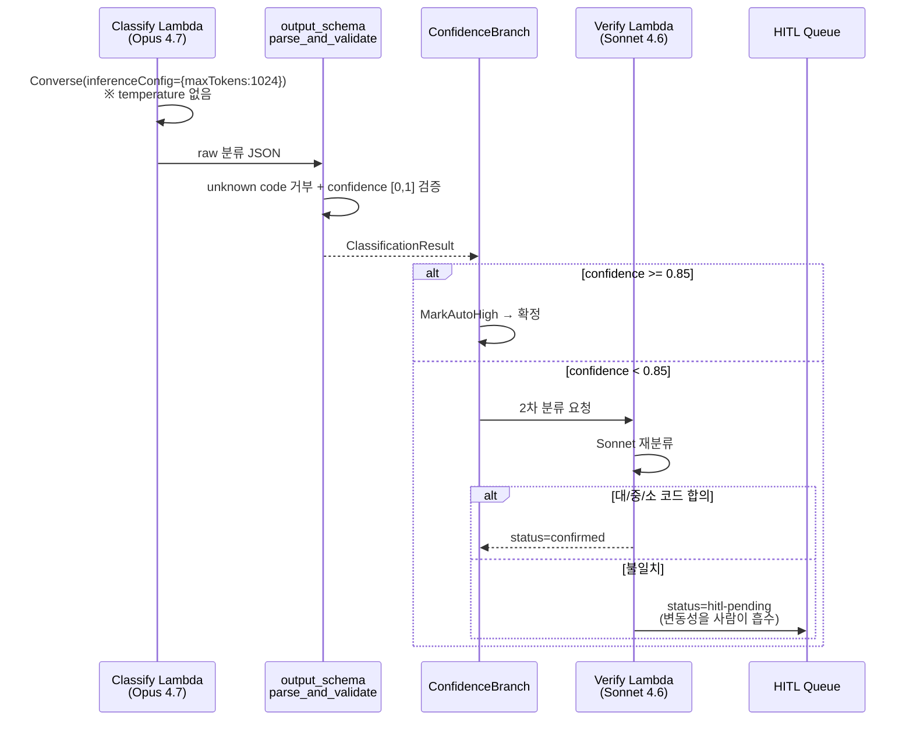
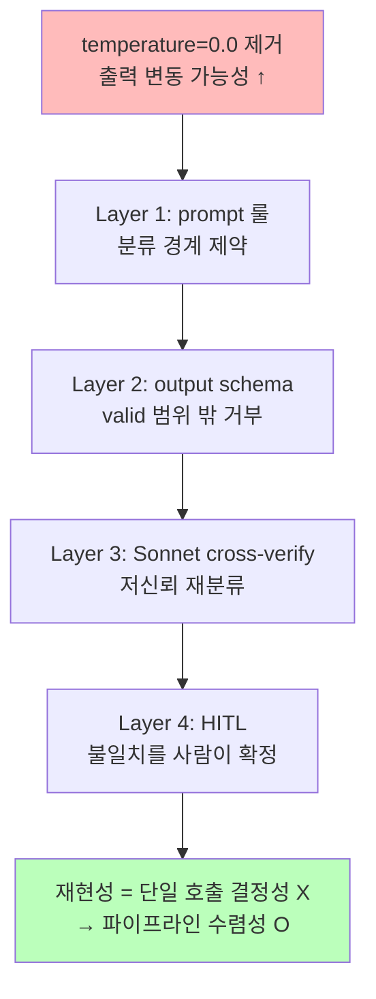

# ADR-014: Opus 4.7 temperature 파라미터 제거 — 결정성 담보 전략

- **Status**: Accepted
- **Date**: 2026-05-30
- **Deciders**: project owner
- **Affects**: `src/lib/bedrock_client.py`, `src/lambdas/classify/`, `src/lambdas/verify/`

## Context

dev 환경 smoke test 에서 Bedrock Converse 호출이 다음 에러로 실패:

```
ValidationException: The model returned the following errors:
temperature is not supported
```

Claude Opus 4.7 (`global.anthropic.claude-opus-4-7`) 모델 카드 변경: `temperature` / `top_p` / `top_k` 샘플링 파라미터를 더 이상 받지 않는다 (breaking change). 기존 `BedrockAdapter.classify()` 는 `inferenceConfig={"temperature": 0.0, "maxTokens": 1024}` 를 전달했으므로 모든 호출이 ValidationException.

**핵심 긴장**: 본 시스템은 **분류 결과 재현성**에 강하게 의존한다:
- 골든셋 정확도 -2%p 회귀 시 CI fail 정책
- Sonnet 4.6 cross-verify 합의/불일치 분기 (verify Lambda)
- 운영팀이 동일 통화 재검토 시 일관된 결과 기대

`temperature=0.0` 은 이 재현성의 핵심 수단이었다. 제거 시 동일 입력에 대해 모델 출력이 변동될 가능성.

## Decision

**`temperature` 를 `inferenceConfig` 에서 제거** (Opus 4.7 강제 사항). 결정성은 다음 다층 방어로 담보:

1. **Prompt 룰**: `system_rules.md` 의 R1~R5 + taxonomy_tree 가 분류 경계를 명시적으로 제약 → 모델 자유도 최소화
2. **Output schema 검증**: `lib.output_schema.parse_and_validate` 가 unknown code 거부 + confidence 범위 강제 → 변동이 valid 범위 밖으로 새지 않음
3. **Sonnet cross-verify**: confidence < 0.85 시 verify Lambda 가 2차 분류 → 불일치 시 HITL 큐로 라우팅 (변동성을 사람이 흡수)
4. **maxTokens=1024 유지**: 출력 길이 상한은 그대로

**샘플링 파라미터 정책**: `temperature` 뿐 아니라 `top_p` / `top_k` 도 `inferenceConfig` 에 전달하지 않는다 (셋 모두 Opus 4.7+ 미지원). `inferenceConfig` 의 허용 key 는 `maxTokens` 단독. 회귀 테스트가 3개 모두 부재를 가드.

`temperature` 미지원은 **모델 측 강제 사항**이므로 대안 선택지가 없다. 본 ADR 은 "제거하되 재현성을 어떻게 담보하는가" 의 결정.

## Architecture Flow



### 결정성 손실 → 다층 흡수



## Consequences

### Positive
- Opus 4.7 ValidationException 해소 — dev/stg/prd 모두 정상 호출
- 결정성을 단일 모델 파라미터가 아닌 **파이프라인 전체** 가 담보 → 모델 교체 (Phase 3 ML cascade) 시에도 동일 방어 유효
- 코드 1줄 변경 (`inferenceConfig` 에서 temperature key 제거)

### Negative
- 동일 입력 N회 호출 시 출력이 미세 변동 가능 → 골든셋 평가 noise 증가 가능. baseline 재측정 필요.
- verify 단계 불일치율이 소폭 상승할 수 있음 (변동이 confidence 경계 근처에서 분기 흔들림). 운영 1주 후 `classification.verifyTriggered` agreement 비율 모니터링.

### Neutral
- maxTokens=1024 유지 — 출력 길이 정책 불변.
- Sonnet 4.6 (verify) 도 동일하게 temperature 미전달 (이미 동일 BedrockAdapter 사용 시 일관).
- Phase 3 plan 의 `temperature: 0.0/0.9/1.0` 다중 사용처는 SageMaker self-hosted 모델용 — Bedrock Opus 와 무관.

## Alternatives Considered

### Option A: temperature 유지 (현상 유지)
모델이 ValidationException 반환 → 전체 파이프라인 동작 불가. 선택 불가.

### Option B: 다른 모델로 회귀 (예: Sonnet 4.6 단독)
정확도 우선 정책상 Opus primary 가 spec 결정사항 (ADR-001/010). temperature 때문에 모델 격하는 부적절.

### Option C: "지원 모델일 때만 temperature 주입" 헬퍼
모델별 supported set 분기 로직. YAGNI — 현재 Opus 4.7 / Sonnet 4.6 모두 미지원이라 분기 무의미. Phase 3 에서 SageMaker 모델 도입 시 재검토.

## Implementation Notes

- `src/lib/bedrock_client.py:47` — `inferenceConfig={"maxTokens": self.max_tokens}` (temperature key 제거)
- `BedrockAdapter.__init__` 의 `max_tokens` 파라미터는 유지 (출력 길이 제어)
- **회귀 가드**: `tests/unit/test_bedrock_client.py::test_inference_config_has_no_temperature` — `converse` call_args 의 `inferenceConfig` 에 `temperature` key 가 없음을 assert. 미래에 무심코 되돌리는 것 차단.
- 두 CLAUDE.md 동기화: `src/lib/CLAUDE.md`, `src/lambdas/classify/CLAUDE.md` (Auto-Sync Rule 준수)
- 골든셋 baseline: 변동성 측정 하니스를 `scripts/eval_prompt.py --runs N` 으로 제공 (per-row (대,중,소) 라벨 안정성 → `tests/golden/variance-report.csv`). 운영팀이 dev apply 후 `python scripts/eval_prompt.py --runs 5 --skip-tbd` 실호출하여 변동성 측정, unstable row 발견 시 baseline 갱신 / verify 임계값 재검토. 하니스 단위 테스트: `tests/unit/test_eval_prompt.py` (mock adapter, 7 케이스 — 실 Bedrock 불필요).

## References

- 관련 코드: `src/lib/bedrock_client.py`, `src/lambdas/classify/handler.py`, `src/lambdas/verify/handler.py`
- 관련 ADR: [[ADR-001-pluggable-inference-adapter]], [[ADR-002-two-breakpoint-prompt-cache]], [[ADR-010-global-bedrock-cris]]
- dev smoke test 실패 로그 (PR #20): `ValidationException: temperature is not supported`
- Anthropic Claude Opus 4.7 model card (sampling parameter removal)
