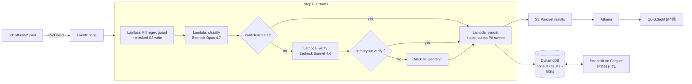
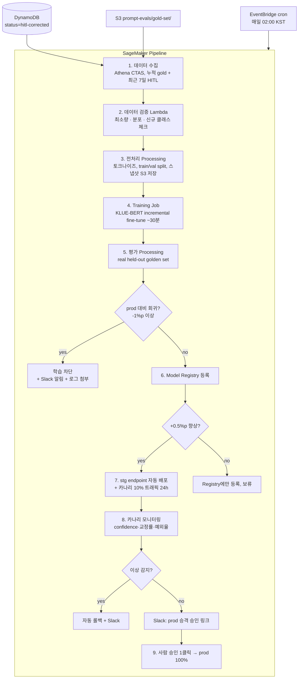

# 콜센터 STT 상담 자동 분류 시스템 — 설계서

- **버전**: v1.0
- **작성일**: 2026-05-22
- **상태**: 사용자 검토 대기
- **분류 체계 원본**: `/home/atomoh/kakaopay/callcenter/상담어시스트_AWS전달자료.xlsx`
  - 대분류 18 / 중분류 64 / 소분류 131 (총 213 노드)
  - 노드별 v4 description: 평균 ~300자, 최대 500자, 총 ~44.6K자

---

## 1. 목표 / 범위

### 1.1 목표
- 콜센터 STT(녹취 음성→텍스트)가 S3에 업로드되면 자동으로 카카오페이 표준 분류(대/중/소)를 부여한다.
- 운영팀이 **저신뢰 건**을 검수하여 정답 라벨을 누적할 수 있어야 한다.
- 분석팀이 분류 결과를 **트렌드·집계·드릴다운**으로 볼 수 있어야 한다.
- 정확도를 속도보다 우선한다.
- **분류기는 모델 교체 가능한(pluggable) 설계**로 한다 — v1은 LLM(Bedrock) 호출, 데이터가 충분히 축적되면 자체 ML 모델(파인튜닝 인코더, LoRA-튜닝 LLM, 분류기)로 무중단 교체·혼용 가능해야 한다. 자세한 조건·임계점은 §3.7 참조.

### 1.2 범위 외 (Non-goals)
- STT 변환 자체는 외부에서 이미 수행되어 S3에 업로드된다고 가정한다.
- 상담 요약(summary) 생성은 본 설계 범위 외 (xlsx 두 번째 시트에 별도 프롬프트 이력 있음 — 차후 별도 워크).
- 실시간(수 초 이내) 응답은 요구 없음. 비동기 처리 OK.

### 1.3 성공 기준

**Phase 1 (v1, LLM only)**:
- 운영 시작 1개월 후 HITL 교정률 < 15% (자동 분류 정확도 ≥ 85%, 평가셋 누적 시점에 측정 가능)
- Step Functions 실패율 < 0.5%
- 일 처리량 1만 건까지 안정 동작
- PII(계좌·카드·주민·휴대폰) `reason` 필드 누설률 0%

**Phase 3 (자동 학습 파이프라인)**:
- HITL 라벨 누적 500건 도달 시점에 첫 대분류 fine-tuned 모델 카나리 배포
- 자동 재학습 파이프라인 일 1회 실행, 실패율 < 5%
- 모델 회귀 게이트 통과율 ≥ 70% (정상 학습 결과 비율)
- ML 캐스케이드 적용 시 LLM 호출 비용 ≥ 50% 절감 (정확도 -3%p 이내 유지)

---

## 2. 아키텍처

### 2.1 컴포넌트 일람

| 영역 | 컴포넌트 | 역할 |
|------|----------|------|
| 인입 | S3 `kakaopay-callcenter-stt-raw` | 상담 STT 결과(JSON) 자동 업로드 위치 |
| 트리거 | EventBridge → Step Functions Express | S3 PutObject 1건 = SFN 실행 1회 |
| 오케스트레이션 | AWS Step Functions (Express) | 단계 분기·재시도·DLQ 시각 관리 |
| 처리 | Lambda × 4 + 분기 상태 | PII 가드 / 분류 / 검증 / 적재 |
| **분류 추론 (pluggable)** | **Inference Adapter — LLM 또는 ML 모델** | v1: Bedrock Opus 4.7 / Sonnet 4.6 (ap-northeast-2). v2+ 옵션: 자체 호스팅 LLM(Qwen on SageMaker), 인코더 파인튜닝(KoBERT/KLUE-BERT), LoRA 튜닝 Qwen, XGBoost on embeddings 등. classify·verify Lambda는 어댑터 인터페이스만 호출하므로 모델 교체 시 SFN 정의·DDB 스키마 변경 0건. |
| 운영 데이터 | DynamoDB `consult-results` + GSI ×3 | 단건 조회, HITL 큐 |
| 분석 데이터 | S3 `consult-results-parquet` + Glue + Athena | BI 데이터 소스 |
| BI | QuickSight | 분석팀 트렌드/집계 |
| HITL UI | Streamlit on Fargate + Cognito | 운영팀 검수 |
| IaC | Terraform (workspace 분리) | dev/stg/prd |
| 알림 | CloudWatch Alarms → SNS → Slack Webhook | 단일 채널 |
| **MLOps (v2+)** | **SageMaker Pipelines + Model Registry + Endpoint + Model Monitor** | **자동 재학습·평가·블루/그린 배포 (§3.8)** |

### 2.2 데이터 흐름 (v1 — Phase 1)



### 2.3 Phase 2 계획 (조건부 진입)

다음 중 하나 발생 시 진입:
- `reason` 필드의 소프트 PII(이름/주소) 누설률 > 1% (운영 1개월 측정)
- 컴플라이언스/법무 추가 요구
- 정기 일 처리량 > 1만 건

Phase 2에서는 PII 단계를 **SageMaker Async Endpoint + Qwen2.5-7B-Instruct (vLLM)** 로 분리:
- ECS GPU 24/7 대비 요청 기반 과금 (idle 시 0대 스케일)
- 마스킹된 본문 S3에 별도 prefix로 저장 → classify Lambda는 masked만 읽음

### 2.4 입출력 페이로드

**입력 (S3 객체 예)**:
```json
{
  "callId": "call_20260522_001",
  "agentId": "A1234",
  "startedAt": "2026-05-22T10:14:33Z",
  "durationSec": 312,
  "transcript": [
    {"speaker":"agent","text":"안녕하세요 카카오페이입니다 ..."},
    {"speaker":"customer","text":"제 페이머니가 충전이 안되는데요 ..."}
  ]
}
```

**분류 결과 (DynamoDB record)**:
```json
{
  "callId":"call_20260522_001",
  "classifiedAt":"2026-05-22T10:20:11Z",
  "category": {
    "대": {"code":"CS_CENTER_CONSULT_TYPE_PAY_MONEY","name":"페이머니"},
    "중": {"code":"CS_CENTER_CONSULT_TYPE_PAY_MONEY_CHARGE_WITHDRAWAL","name":"충전/출금"},
    "소": {"code":"CS_CENTER_CONSULT_TYPE_PAY_MONEY_CHARGE_DELAY","name":"충전 지연/오류"}
  },
  "confidence": 0.88,
  "reason": "고객이 충전 오류를 호소함. 송금/결제는 아님.",
  "alternativesConsidered": [
    {"code":"CS_..._USAGE_HISTORY","why_rejected":"'내역'이 아닌 '오류' 문맥"}
  ],
  "verified": "auto-high",
  "status": "confirmed",
  "modelPath": ["opus-4-7"],
  "promptVersion": "v1.0",
  "piiMaskedTextRef":"s3://.../call_..._masked.txt",
  "rawSttRef":"s3://.../call_....json"
}
```

> 참고: 분류 코드는 xlsx 원본의 표기를 그대로 보존한다. xlsx에는 `MONEY`가 `NONEY`로, `PAYMENT`가 `PAYNENT`로 표기된 오타가 있으나 **시스템 식별자이므로 변경하지 않는다**. (예: `CS_CENTER_CONSULT_TYPE_PAY_NONEY`)

---

## 3. 분류 프롬프트 설계 (시스템의 핵심)

### 3.1 프롬프트 구조 (Bedrock Converse API + Prompt Caching)

```
[system message — cache breakpoint #1]  (거의 변경 없음)
  ├ 역할/목적/절대원칙
  ├ 분류 가이드라인 룰 (R1~R5)
  └ 출력 JSON 스키마 명세

[system message — cache breakpoint #2]  (분류 트리)
  └ 전체 213노드 트리 + 각 노드 description (~30K tokens)

[user message — 호출마다 변경]
  ├ {{masked_transcript}}
  └ 출력 형식 강제 지시
```

- Bedrock prompt cache TTL = 5분
- 캐시 적중률 90%+ 목표 → 운영 트래픽 흐름과 맞추기 위해 5분마다 **워밍 ping**(CloudWatch Events + Lambda dummy call) 옵션 검토

### 3.2 분류 트리 직렬화

xlsx → JSON 변환 → 프롬프트 텍스트 조립.

```
## [대분류] 페이머니 — code: CS_CENTER_CONSULT_TYPE_PAY_NONEY
설명: 카카오페이의 핵심 기능인 '페이머니'의 충전, 사용, 송금 등 잔액과 관련된 모든 활동...
[핵심 구분] 페이머니를 '사용하여' 상품 구매하는 '결제' 문의는 '국내온라인/오프라인결제'로,
'비밀번호' 문제는 '본인인증'으로 분류.

  ### [중분류] 충전/출금 — code: CS_..._CHARGE_WITHDRAWAL

    #### [소분류] 이용/내역 — code: CS_..._USAGE_HISTORY
        설명: ...

    #### [소분류] 충전 지연/오류 — code: CS_..._CHARGE_DELAY
        설명: ...
```

- description이 비어 있는 중간 노드(중분류 다수)는 **부모 description을 상속** — LLM 시스템 메시지에 상속 규칙 명시

### 3.3 출력 JSON 스키마

```json
{
  "대": {"code": "string", "name": "string"},
  "중": {"code": "string", "name": "string"},
  "소": {"code": "string", "name": "string"},
  "confidence": "number 0..1",
  "reason": "string ≤ 500 char, NO PII",
  "alternativesConsidered": [
    {"code": "string", "why_rejected": "string ≤ 200 char, NO PII"}
  ]
}
```

- Bedrock Structured Output(JSON enforcement)으로 스키마 위반 0% 강제
- `reason`/`alternatives`는 운영팀·분석팀에 노출되므로 PII 금지

### 3.4 분류 가이드라인 룰 섹션

xlsx description의 `[핵심 구분]` 패턴을 통합 룰로 정리.

```
R1 (기능 vs 결제 분리): 페이머니를 사용해 구매한 결제 문의는 결제 카테고리
    (국내/해외 온·오프라인결제)로 분류. 페이머니 자체의 충전·송금·잔액 문의만 페이머니로.

R2 (비밀번호는 항상 본인인증): 결제·송금·계정 어디서든 비밀번호/생체인증/PIN
    오류는 본인인증으로.

R3 (대분류 우선): 대분류 description의 [핵심 구분]이 명시한 매핑은 중·소분류
    description보다 우선.

R4 (어쩔 수 없을 때): 명백히 해당 없으면 "기타"로 분류하고 reason에 보류 사유 명시.

R5 (PII 인용 금지): 출력의 reason / alternativesConsidered 필드에는 고객명, 전화번호,
    계좌·카드·주민번호, 주소 등 어떤 개인정보도 포함하지 마라. 분류 근거는
    "고객이 충전 오류를 호소함"처럼 일반화된 표현만 사용한다.
    인용이 불가피하면 [개인정보]로 대체한다.
```

운영 중 발견한 새 룰은 이 섹션을 점진 확장. 평가셋 없이도 정확도를 끌어올리는 가장 빠른 방법.

### 3.5 검증(Verification) 호출 정책

`classify` Lambda가 다음 조건 중 하나에 해당하면 `verify` 단계로 분기:
- `confidence < 0.80`
- `alternativesConsidered[0]`의 점수가 main과 0.15 이내

`verify` Lambda는:
- Sonnet 4.6 호출 (동일 분류 트리 시스템 캐시 공유)
- Primary(Opus) 출력을 보여주고 "동의/반박" 결정 + 자체 분류 결과 요청
- 합의(같은 대/중/소 코드) → `verified="auto-confirmed"`
- 불일치 → `status="hitl-pending"`, `verified="hitl-pending"`로 HITL 큐 진입

### 3.6 평가 / 회귀 방지

- **초기 골든셋**: 손 라벨링한 50~100건을 `tests/golden/`에 저장. CI에서 PR마다 자동 평가.
- **HITL 누적 → gold-set 승격**: 운영 중 HITL 교정 결과가 1천 건 누적되면 평가셋으로 자동 승격 (Athena 쿼리 + S3 export 스크립트)
- **버저닝**: 프롬프트는 `src/prompts/v{N}.{M}/` 디렉토리로 관리. 모든 DDB record에 `promptVersion` 기록. (자체 ML 모델 도입 시 `modelVersion` 필드도 동일 방식)
- **회귀 게이트**: CI에서 대/중/소 정확도가 직전 main 대비 -2%p 떨어지면 fail.

### 3.7 모델 선택 전략 — LLM ↔ ML 데이터 임계점

본 시스템은 **분류기를 모델 교체 가능한 어댑터로 추상화**한다. classify·verify Lambda는 `InferenceAdapter` 인터페이스만 호출하고, 어댑터 구현체가 LLM API 호출이든 SageMaker 엔드포인트 호출이든 무관하게 동일 출력 스키마(§3.3)를 반환한다.

#### 3.7.1 어댑터 인터페이스

```python
class InferenceAdapter(Protocol):
    name: str            # "bedrock-opus-4-7", "kobert-finetuned-v3", "qwen-lora-v2", ...
    version: str         # 어댑터 버전 — DDB의 modelPath/promptVersion에 기록
    def classify(self, masked_transcript: str) -> ClassificationResult: ...
```

이 추상화 덕분에 **어떤 LLM이든, 어떤 ML 모델이든** 다음 중 무엇이든 plug-in 가능:

| 카테고리 | 어댑터 예시 | 사용 시점 |
|----------|-----------|-----------|
| Hosted LLM | Bedrock Opus 4.7 / Sonnet 4.6 / Haiku 4.5 (v1 기본) | 라벨 데이터 0~수백 건 단계 |
| Self-hosted LLM | Qwen2.5-7B/14B on SageMaker (vLLM) | 외부 송신 차단 / 비용 최적 / 한국어 강화 필요 시 |
| 인코더 분류기 | KLUE-BERT, KoELECTRA, KoBERT를 fine-tune | 라벨 누적 충분 + 대/중분류 라우팅용 |
| LoRA 튜닝 LLM | Qwen2.5-7B + LoRA adapter | 인코더보다 정확도 추가 확보, 자원 적당 |
| 트리 기반 분류기 | XGBoost on 임베딩 (Cohere/Titan) | 빠른 baseline, 해석 가능성 중시 |
| 캐스케이드(추천) | ML이 confident하면 ML 채택, 아니면 LLM fallback | 비용·정확도 동시 최적 |

#### 3.7.2 데이터 임계점 (대략적 가이드)

| 접근 방식 | 클래스당 최소 라벨 수 | 213 노드 환산 (소분류까지) | 도입 가능 시점 |
|----------|-----------------------|--------------------------|----------------|
| **LLM zero-shot** (v1) | **0** (description만) | 0건 + 평가용 50~100건 | 즉시 — v1 |
| LLM few-shot in-context | 5~20 | 1K~4K (대표 샘플) | HITL 누적 1~3개월 |
| **LoRA 튜닝 LLM** | **50~200** | **10K~40K** | HITL 누적 6~12개월 |
| **인코더 fine-tune (KoBERT 등)** | **100~500** | **20K~100K** | HITL 누적 12개월+ |
| XGBoost on embeddings | 100~300 | 20K~60K | 위와 동일, 빠른 baseline용 |

> **핵심**: ML 모델로 LLM을 대체하려면 **소분류(131 클래스) 기준으로 최소 2만 건, 권장 10만 건 라벨이 필요**. 대분류만 ML로 대체하면 1.8K~9K로 충분하므로 **대분류 ML + 중/소 LLM** 캐스케이드가 가장 현실적인 첫 ML 도입 경로.

#### 3.7.3 ML 도입 단계적 경로

1. **v1 (현재)**: LLM only. HITL 라벨 누적.
2. **v1.5 (HITL 누적 ~2K)**: few-shot 예시를 프롬프트에 동적 주입 (RAG). 비용 큰 변화 없이 정확도 추가 확보.
3. **v2 (HITL 누적 ~2만, 대분류 위주)**: 대분류 전용 KLUE-BERT 또는 KoELECTRA fine-tune → SageMaker Real-time Endpoint. classify Lambda가 ML 어댑터 먼저 호출, confidence ≥ 0.9이면 채택, 아니면 LLM 폴백. 비용 절감 효과 큼.
4. **v3 (HITL 누적 ~10만)**: 중/소분류까지 fine-tuned ML 모델 (LoRA-Qwen 또는 다단계 인코더 분류기). LLM은 verify/롱테일·신규 카테고리 전용.

이 경로는 모두 §2.1의 어댑터 추상화 덕분에 **classify Lambda 코드 변경 없이** 어댑터 교체만으로 진입 가능.

#### 3.7.4 데이터 수집 가속 전략

ML 도입을 앞당기려면 라벨 데이터 누적 속도를 끌어올려야 한다:

- **샘플링률 상향**: 일 50건 무작위 HITL 샘플 → 일 200~500건으로 (운영팀 부담과 균형)
- **Active learning**: confidence가 낮거나 verify 단계에서 Opus/Sonnet이 불일치한 건을 우선 HITL 큐로
- **다중 LLM 합의 → pseudo-label**: Opus + Sonnet + Haiku 3개 모델 합의 시 자동 gold-set 승격 (사람 검수 없이도 누적)
- **상담원 자가 라벨링 UI**: 통화 종료 후 상담원이 직접 분류 입력하면 즉시 gold-set화

#### 3.7.5 합성 데이터 증강 fine-tuning 전략

Phase 3 진입 전 라벨 부족을 합성으로 보강. **HITL 누적 ~500건 시점에 대분류(18 클래스) fine-tuning을 시도 가능**한 규모.

**필요 데이터 (대분류 fine-tuning 1차, 총 ~5.7K)**:

| 출처 | 건수 | 역할 |
|------|------|------|
| Real HITL 라벨 | 200~500 | **실제 분포 anchor** (가장 중요) |
| LLM 합성 (Opus, 카테고리별 시드 기반) | ~3,500 | 분포 채우기. 다중 LLM 합의 필터 통과분만 채택 |
| LLM paraphrase (real × 10배) | ~2,000 | 실제 분포 weighting 강화 |
| **Held-out 평가셋 (real STT only)** | 100 | **학습 불가**, 검증 전용 |

**가장 큰 함정 — 분포 시프트**:

LLM이 만든 합성 대화는 실제 STT와 길이·어휘·턴 수·노이즈 모두 다르다. 합성에서 95% 정확도가 real에서 70~75%로 추락하는 함정이 빈번. 따라서:
- 검증셋은 **반드시 real STT 샘플**로만 구성
- 합성 데이터에 STT 노이즈 패턴(필러 "어/음", 띄어쓰기 오류, 동음이의 오인식) 인공 삽입
- 카테고리별 시드 = description + real 샘플 2~3건 (real 분포 학습)
- 다중 LLM 합의 필터: Opus 생성 → Sonnet 분류 → 라벨 일치 ~70%만 채택

**모델 / 학습 환경**:
- **KLUE-BERT** (RoBERTa Korean) base 또는 **KoELECTRA** — 한국어 NLP 표준, 작음
- SageMaker Training Job, ML.g5.xlarge (spot 인스턴스), 3~5 에폭, ~30분~1시간
- 평가: real held-out 100건에서 대분류 정확도

**예상 결과 (보수적)**:
- ML 단독 대분류: 75~85% (real 평가셋)
- LLM zero-shot (Opus): 88~92%
- **캐스케이드 (ML conf ≥ 0.9이면 ML, 아니면 LLM)**: ~88% 정확도, LLM 호출 60% 절감

**캐스케이드 비용·정확도 (일 1만 건)**:

| 시나리오 | ML 처리율 | LLM 호출 | 정확도 | 비용 |
|----------|----------|---------|--------|------|
| LLM only (현재 v1) | 0% | 100% | ~90% | ~$25 |
| ML only (합성 fine-tune) | 100% | 0% | ~80% | ~$2 |
| **캐스케이드 (권장)** | ~65% | 35% | ~88% | ~$10 |

→ 비용 60% 절감, 정확도 -2%p 손실. real 라벨 누적될수록 ML 정확도 ↑ → 격차 축소.

### 3.8 MLOps — 자동 학습 파이프라인 (Continuous Learning)

운영팀·분석가·도메인 전문가가 HITL UI에서 라벨을 교정하면 **다음날 새벽에 모델이 자동으로 재학습되고 평가 게이트를 통과하면 카나리 배포까지 자동 진행**되는 폐쇄 루프. 데이터 누적이 즉시 모델 개선으로 이어지는 짧은 피드백 사이클을 보장한다.

#### 3.8.1 핵심 원칙

- **사람이 가르치면 다음날부터 모델이 알게 된다** — 24h 이내 사이클
- **평가 게이트 통과한 모델만 자동 승격** — 회귀 절대 방지
- **감사 가능** — 모든 학습 데이터/모델/평가 결과 S3에 스냅샷 보존
- **수동 개입 최소화** — prod 100% 승격만 사람 클릭 1회

#### 3.8.2 전체 흐름



#### 3.8.3 구성 요소

| 영역 | 컴포넌트 | 역할 |
|------|----------|------|
| 스케줄러 | EventBridge cron (`cron(0 17 * * ? *)` UTC = 02:00 KST) | 매일 트리거 |
| 오케스트레이션 | SageMaker Pipelines | 학습→평가→등록→배포 단계 그래프 |
| 데이터 추출 | Glue Catalog + Athena CTAS | 최근 7일 sliding window 학습셋 stage |
| 데이터 검증 | Lambda + Great Expectations 또는 Deequ | 최소량/분포/스키마 게이트 |
| 학습 | SageMaker Training Job (G5.xlarge spot) | KLUE-BERT incremental fine-tune ~30분 |
| 모델 저장소 | SageMaker Model Registry | 버전 관리, lineage tracking, A/B compare |
| 평가 | SageMaker Processing Job | held-out golden set 정확도/F1, 클래스별 성능 |
| 배포 | SageMaker Endpoint Production Variants | 블루/그린, 카나리 10%→100% |
| 모니터링 | SageMaker Model Monitor + CloudWatch | drift, confidence 분포, 예외율 |
| 알림 | SNS → Slack | 학습 결과 / 회귀 차단 / 카나리 시작·완료 / 승인 요청 |

#### 3.8.4 데이터 수집 SQL

```sql
-- Athena CTAS, 매일 02:00 KST 새 학습 데이터 stage
CREATE TABLE training_set_${date} WITH (
    format = 'PARQUET',
    external_location = 's3://kakaopay-callcenter-ml/training-sets/date=${date}/'
) AS
SELECT
  pii_masked_text_ref AS text_s3_uri,
  category_대code AS label_대,
  category_중code AS label_중,
  category_소code AS label_소,
  'hitl' AS source
FROM consult_results
WHERE status = 'hitl-corrected'
  AND corrected_at >= CURRENT_DATE - INTERVAL '7' DAY
UNION ALL
SELECT
  text_s3_uri,
  label_대, label_중, label_소,
  'gold' AS source
FROM prompt_evals.gold_set
WHERE prompt_version IS NOT NULL;
```

#### 3.8.5 데이터 검증 게이트 (재학습 트리거 조건)

| 조건 | 기준 | 위반 시 |
|------|------|---------|
| 신규 라벨 최소량 | 지난 7d 새 HITL 교정 ≥ 50건 | 학습 스킵, 누적 대기 |
| 클래스 커버리지 | 대분류 18개 중 최소 15개 등장 | 경고만, 학습 진행 |
| 분포 skew | 한 클래스 > 50% 점유 | 클래스 가중치 자동 조정 |
| 신규 클래스 발견 | description에 없는 새 코드 등장 | 학습 차단, 분석팀 알림 |
| 평균 confidence 급락 | 전일 대비 -10%p | 즉시 알림 + 학습 진행 (drift 감지용) |

#### 3.8.6 자동 승격 게이트

1. **회귀 방지**: 새 모델 vs prod 모델 정확도 → -1%p 이상 → 차단
2. **개선 기준**: +0.5%p 이상 향상 → stg 자동 배포 + 카나리 10% 24h
3. **카나리 모니터링** (24h): confidence Δ, HITL 교정률, 예외율
4. **prod 승격**: 카나리 정상 + 메트릭 유지 → **Slack 승인 링크 1클릭** → prod 100%
5. **자동 롤백**: 카나리에서 confidence -5%p 또는 예외율 +200% 감지 시 즉시 이전 버전 복원

#### 3.8.7 분석가/도메인 전문가 인터페이스 (Streamlit HITL UI 확장)

기존 검수 UI에 다음 페이지 추가:

- **"오늘의 모델 업데이트"** — 어젯밤 학습 결과 요약 (정확도 변화, 카테고리별 개선/회귀)
- **"학습 잠금/해제"** — 검증 중인 라벨이 많을 때 임시 학습 보류
- **"클래스 가중치 조정"** — 희소 카테고리 우선 학습 가중치
- **"수동 평가셋 추가"** — UI에서 직접 라벨링 → 즉시 golden set 추가
- **"승격 승인 대기열"** — 카나리 통과 모델 prod 승격 1-클릭 승인

#### 3.8.8 스토리지 / 보존

```
s3://kakaopay-callcenter-ml/
├── training-sets/date=YYYY-MM-DD/*.parquet    # 학습 데이터 스냅샷 (재현성)
├── models/run=YYYYMMDD-HHMM/                  # weights + config + 메트릭
├── eval-results/run=YYYYMMDD-HHMM/            # confusion matrix, per-class F1
└── lineage/                                    # 어떤 데이터로 어떤 모델 학습? lineage graph
```

- training-sets: 90일 보존 후 Glacier IR
- models: **영구 보존** (rollback 대비)
- eval-results: 1년 보존

#### 3.8.9 비용 (Phase 3 가동 시 추가)

| 항목 | 일 비용 |
|------|---------|
| Training Job (G5.xlarge spot, 30분) | ~$1 |
| Processing (전처리+평가) | ~$0.5 |
| Endpoint (ML.g5.xlarge 24/7, 캐스케이드 추론용) | ~$22 |
| Athena scan + S3 storage | ~$1.5 |
| **추가 합계** | **~$25/day** |

→ Phase 1 ($25~40) + Phase 3 ($25) = ~$50~65/day. 단, ML 캐스케이드로 LLM 비용 60% 절감하면 실질 추가 비용은 ~$10/day 수준.

#### 3.8.10 Terraform 모듈 추가

```
modules/
└── continuous-learning/
    ├── schedule.tf       # EventBridge cron
    ├── pipeline.tf       # SageMaker Pipeline definition
    ├── training.tf       # Training Job + ECR image + Spot 설정
    ├── registry.tf       # Model Registry, ModelPackageGroup
    ├── endpoint.tf       # blue/green Production Variants
    ├── monitoring.tf     # Model Monitor + CloudWatch alarms
    └── data-prep.tf      # Glue/Athena, S3 staging
```

#### 3.8.11 핵심 메트릭 (CloudWatch + QuickSight 통합)

- `model.accuracy.daily` — 매일 평가셋 정확도 (대/중/소 각각)
- `model.training.duration` — 학습 소요 시간
- `model.gold-set.size` — 누적 정답 라벨 수 추이
- `model.canary.confidence_delta` — 카나리 vs prod confidence 차이
- `model.deployment.count` — 일/주별 자동 승격 횟수
- `model.classWise.f1` — 카테고리별 F1 score (drift 조기 감지)

분석팀 대시보드(QuickSight)에 새 시트 **"ML 진화"** 추가 — 시간에 따른 정확도 곡선, 카테고리별 학습 효과, 새로 추가된 정답 라벨 수 추이.

---

## 4. PII 처리 (Phase 1 — 프롬프트 + 정규식 가드)

### 4.1 결정

Phase 1은 **dedicated PII 서비스(SageMaker Async + Qwen)를 두지 않는다**. 대신 다음 3중 가드:

1. **PII Guard Lambda (별도 단계, 정규식 기반, Python 30줄)**
   - Step Functions의 첫 단계로 분류 Lambda 앞에 배치 (다이어그램 2.2 참조)
   - 계좌번호 (10~14 digit), 카드번호 (13~19 digit + Luhn), 주민번호 (`\d{6}-?\d{7}`), 휴대폰 (`01\d-?\d{3,4}-?\d{4}`) → `[MASKED_*]` 토큰 치환
   - 결과를 S3 `stt-masked/` prefix에 저장 (재현성 + 감사용)
   - 마스킹 적중 카운트는 메트릭 (`pii.maskApplied`, dim=PII type)
   - Phase 2 진입 시 본 Lambda를 SageMaker Async invoke Lambda로 **교체만 하면 됨** (인터페이스 유지)

2. **프롬프트 룰 R5** (위 3.4 참조) — LLM에게 출력 PII 인용 금지 명시

3. **Persist Lambda의 출력 후처리 정규식 스윕** — DDB write 전 `reason`/`alternativesConsidered` 텍스트에 동일 정규식 재적용. LLM이 합성 PII를 만들어도 차단.

### 4.2 Phase 1의 한계 (명시)

- **하드 PII**(숫자형 식별자) 누설 위험은 사실상 0
- **소프트 PII**(고객 이름, 주소) 위험은 모델 지시에만 의존 — 운영 모니터링 필요
- 사내 컴플라이언스가 "Raw STT 외부 송신 금지"를 명시한 경우 진입 차단 — **확인 책임은 본 프로젝트 외부**

### 4.3 Phase 2 진입 조건 (재정의)

- `reason` 필드 소프트 PII 누설률 > 1% (운영 1개월 측정, 분석팀이 샘플링 검수)
- 컴플라이언스/법무 추가 요구
- 정기 일 처리량 > 1만 건

### 4.4 Phase 2 청사진

- SageMaker Async Endpoint + Qwen2.5-7B-Instruct (vLLM 컨테이너)
- VPC private subnet only, ML.g5.xlarge (idle 시 min=0)
- Step Functions는 새 단계 `pii-mask-svc` 만 추가, 나머지 로직 변경 없음

---

## 5. 데이터 스토리지 모델

### 5.1 DynamoDB `consult-results`

```
PK: callId

attributes:
  agentId, startedAt, durationSec
  category_대code, category_중code, category_소code, 각 name
  confidence (0..1)
  reason (string ≤ 2KB)
  alternativesConsidered (list)
  status: confirmed | hitl-pending | hitl-corrected | hitl-skipped
  verified: auto-high | auto-confirmed | hitl-corrected
  modelPath (list)
  promptVersion
  piiMaskedTextRef (s3://...)
  rawSttRef (s3://...)
  classifiedAt, correctedAt, correctedBy
  ttlEpoch (1년 후, cold 데이터 자동 삭제)
```

**GSI**:
- `GSI1: status-classifiedAt-index` — HITL 검토 큐
- `GSI2: agentId-classifiedAt-index` — 상담원별 통화 조회
- `GSI3: category-daecode-classifiedAt-index` — 카테고리별 통화 조회 (hash key = `category_대code` 속성; DDB index 명은 ASCII 만 허용하므로 `대` 를 `daecode` 로 romanize)

### 5.2 S3 분석 데이터 (Parquet 미러)

```
s3://kakaopay-callcenter-analytics/
├── consult-results/year=YYYY/month=MM/day=DD/hour=HH/part-*.parquet
├── pii-mask-audit/year=.../day=.../*.parquet   (PII 적중 통계)
└── prompt-evals/promptVersion=v1.0/*.parquet   (HITL 교정 gold set)
```

- Firehose buffering 60초 / 1MB
- Glue Catalog로 Athena/QuickSight 노출
- 일 1만 건 × 평균 3KB 압축 = 일 ~30MB

### 5.3 원본 / 마스킹 S3 분리

```
s3://kakaopay-callcenter-stt-raw/     # 원본 STT (강한 ACL, 컴플라이언스만)
s3://kakaopay-callcenter-stt-masked/  # PII regex 가드 적용 후 (파이프라인 + HITL UI)
```

- KMS CMK 별도 (raw 키 vs masked 키)
- raw: 90일 후 Glacier IR, 1년 Deep Archive
- masked: 1년 후 삭제
- Versioning ON + Object Lock(Governance)

### 5.4 비용 추정 (일 1만 건, Phase 1)

| 항목 | 일 비용 (USD, 대략) |
|------|-------------------|
| DynamoDB on-demand | < $2 |
| S3 storage + PUT/GET | < $1 |
| Athena scan (시간당 1회 SPICE) | < $1 |
| Bedrock Opus 4.7 (cache hit 90% 가정) | ~$15~30 |
| Bedrock Sonnet 4.6 verify (10% 트래픽) | ~$1 |
| Firehose | < $1 |
| Streamlit Fargate (256MB / 0.5 vCPU) | ~$5 |
| **합계 (Phase 1)** | **~$25~40/day = ~$0.8~1.2K/month** |

Phase 2 진입 시 SageMaker Async(과금 기반) 추가 ~$10~20/day.

---

## 6. HITL UI + 대시보드

### 6.1 운영팀 HITL 검수 UI (Streamlit on Fargate)

**페이지**:
1. **검토 대기열** (GSI1: `status=hitl-pending`)
2. **단건 상세 화면**:
   - 마스킹 transcript (agent/customer 색 분리)
   - 모델 분류 + confidence + reason + alternatives
   - 분류 트리 드롭다운(대→중→소 cascade) — 교정용
   - "맞다" / "교정" / "스킵" 3 액션
3. **필터/검색**: 기간, 상담원ID, 카테고리, 상태, confidence 범위
4. **컴플라이언스 페이지** (Cognito 별도 그룹만):
   - 명의 검색은 별도 사내 도구로. raw STT 다운로드는 SignedURL + CloudTrail 감사 로그
5. **샘플링 추출 잡**: EventBridge cron + Lambda → 일 50건 무작위 `status=hitl-sampled` 추가

**기술**:
- Streamlit on Fargate 1 task (256MB / 0.5 vCPU)
- Internal ALB + Cognito User Pool (Groups: ops, analyst, compliance)
- DynamoDB SDK 직접 호출, API GW 불필요
- 교정 결과 → DDB update + S3 `prompt-evals/gold-set/` Parquet 누적

### 6.2 분석팀 대시보드 (QuickSight)

| 시트 | 위젯 |
|------|------|
| 개요 | 일/주/월별 통화량 추이, 대분류 18개 도넛, 평균 confidence 추이 |
| 카테고리 드릴다운 | 대→중→소 sunburst, 클릭 시 시계열 필터 |
| 상담원별 | 상담원 × 카테고리 heatmap, HITL 교정률 |
| 품질 | confidence 히스토그램, 자동/사람 일치율, 자주 교정되는 카테고리 Top 10 |
| 트렌드 알람 | 전주 대비 급증 카테고리 |

SPICE 새로고침 시간당 1회.

### 6.3 권한 매트릭스

| 행위 | 운영팀 | 분석팀 | 컴플라이언스 |
|------|--------|--------|--------------|
| HITL 검수 | ✅ | ❌ | ❌ |
| Streamlit 필터·집계 보기 | ✅ | ✅ (R/O) | ✅ |
| QuickSight 대시보드 | ✅ (R) | ✅ (편집) | ✅ (R) |
| 명의 검색 + raw STT 다운로드 | ❌ | ❌ | ✅ |
| 프롬프트 변경 PR | ❌ | ✅ | ❌ |

---

## 7. 운영 (에러·관측성·보안)

### 7.1 재시도 정책

| 단계 | 정책 | 실패 시 |
|------|------|---------|
| classify (Opus) | 5회 exp backoff, ThrottlingException/ServiceUnavailable | DLQ `classify-failed-dlq` |
| verify (Sonnet) | 3회 retry | verify 실패 → `verified="hitl-pending"` 강제 |
| persist (DDB+S3) | 3회 (ConditionalCheck 제외) | DLQ `persist-failed-dlq` |

**Idempotency**: SFN execution name = callId. Persist는 DDB ConditionalPut.
**Safety net cron**: 일 1회 raw S3 listObjects → DDB에 없는 callId 재실행.

### 7.2 메트릭 (CloudWatch Custom)

- `classification.processed` (count, dim=대분류)
- `classification.confidence` (avg, p50, p95)
- `classification.verifyTriggered` (rate %)
- `classification.hitlPending` (gauge)
- `pii.maskApplied` (count, dim=PII type)
- `bedrock.cache.hitRate`

### 7.3 알람 (Slack only)

| 알람 | 조건 |
|------|------|
| `SFN-Failure` | 5분간 실패 ≥ 3 |
| `DLQ-Backlog` | message > 10 |
| `Bedrock-Throttling` | > 10/min |
| `HITL-Backlog` | hitl-pending > 100 (1시간 지속) |
| `Cost-Anomaly` | 일 Bedrock 비용 +50% |
| `PII-Mask-Hit-Drop` | 마스킹 적중률 -50% (회귀 의심) |

### 7.4 보안

- 모든 컴퓨트는 사설 VPC, Bedrock/S3/DDB/KMS는 VPC Endpoint
- S3 raw / S3 masked / DDB / Parquet 모두 별도 KMS CMK
- IAM 최소 권한 (Lambda별, Task Role별 분리)
- CloudTrail 데이터 이벤트 ON
- DynamoDB Streams → audit S3로 변경 이력 영구 보존
- Cognito 인증, 그룹 기반 권한 (ops/analyst/compliance)
- 정적 비밀 없음 (IAM Role 기반). Slack Webhook은 Secrets Manager + 자동 회전

### 7.5 비용 제어

- Bedrock 모델별 쿼터 사전 신청: Opus 4.7 RPM 60 / TPM 200K, Sonnet 4.6 RPM 30
- AWS Budgets: 일 $60 / 월 $1.5K Anomaly 알람
- Cost Allocation Tags: `project=callcenter-classification`, `env`, `component`

---

## 8. 테스트 & 배포

### 8.1 테스트 피라미드

**유닛**:
- `lib/taxonomy.py` — xlsx 파싱 / 트리 직렬화 / desc 상속
- `lib/prompts.py` — 프롬프트 빌더, 캐시 브레이크포인트 검증
- `lib/output_schema.py` — JSON valid/invalid
- `lib/pii_regex.py` — 정규식 적중 (계좌·카드·주민·휴대폰)
- `lib/persist.py` — DDB record · Parquet schema 일치

**통합** (LocalStack / moto / stepfunctions-local):
- SFN 정의 dry-run
- DDB+S3 mock 1 사이클
- EventBridge 패턴 매칭

**모델 골든셋 평가** (가장 중요):
- 손 라벨링 50~100건 → `tests/golden/`
- `scripts/eval_prompt.py` — 정확도 누적 → `eval-history.csv`
- CI PR마다 자동 실행, -2%p 회귀 시 fail
- HITL 누적 1천 건 후 자동 승격

**E2E smoke** (stg):
- 실제 STT 1건 PUT → SFN → DDB/Parquet/Streamlit 화면 확인

### 8.2 Terraform 구조

```
infra/
├── envs/{dev,stg,prd}/main.tf
├── modules/
│   ├── storage/                # S3 raw·masked·analytics, KMS, DDB
│   ├── classify-pipeline/      # SFN Express, Lambdas, EventBridge
│   ├── analytics/              # Glue, Athena, Firehose, QuickSight 데이터셋
│   ├── hitl-ui/                # Fargate, ALB internal, Cognito
│   ├── observability/          # CW dashboard, alarms, SNS→Slack
│   └── shared/                 # VPC Endpoints, IAM common
└── shared-state/               # S3 + DDB lock
```

Phase 2 진입 시 `modules/pii-svc/` 추가 (SageMaker Async + ECR).

### 8.3 CI/CD (GitHub Actions, OIDC)

```
.github/workflows/
├── ci.yml          # PR: lint, pytest, tflint, tfsec, eval-prompt(샘플 5)
├── deploy-dev.yml  # main push → dev + 전체 golden eval
├── deploy-stg.yml  # 수동 → stg + e2e smoke
└── deploy-prd.yml  # 수동 + 승인 → prd
```

### 8.4 프롬프트 버저닝 & 롤백

- `src/prompts/v{N}.{M}/`
- 모든 결과 record에 `promptVersion` 기록
- 새 버전 배포 = canary 10% 트래픽 24h → 100%
- 롤백 = Lambda 환경변수 `PROMPT_VERSION` 변경 + 재배포

### 8.5 운영 런북 (배포 후 산출물)

`docs/runbooks/` 4개:
1. `bedrock-throttling.md`
2. `hitl-backlog.md`
3. `prompt-rollback.md`
4. `pii-mask-failure.md` (Phase 2 진입 시 작성)

---

## 9. 단계별 로드맵

### Phase 1 (v1, ~6주 추정)

| 주차 | 산출물 |
|------|--------|
| W1 | Terraform 베이스 (VPC, S3, DDB, KMS, IAM), xlsx → 분류 트리 JSON 변환기 |
| W2 | classify Lambda + 프롬프트 v1.0 + 출력 스키마, 손 라벨링 골든셋 50건 |
| W3 | Step Functions Express 정의, verify Lambda, persist Lambda, EventBridge |
| W4 | Firehose + Glue + Athena + QuickSight 초기 시트 5개 |
| W5 | Streamlit HITL UI + Cognito + 권한 매트릭스 |
| W6 | CloudWatch dashboard + alarms + Slack, E2E smoke, prd 승인 배포 |

### Phase 2 — PII 마스킹 자체 호스팅 (조건부, +2~3주)

진입 조건은 §4.3 참조.

- SageMaker Async Endpoint + Qwen2.5-7B-Instruct (vLLM)
- Step Functions의 PII Guard Lambda를 SageMaker invoke로 교체 (인터페이스 동일)
- 비용 모니터링 + Phase 1 대비 PII 누설률 비교

### Phase 2.5 — Few-shot RAG 도입 (HITL 누적 ~2K)

- HITL 교정 결과(`prompt-evals/gold-set/`)에서 카테고리별 대표 2~3건을 임베딩 검색으로 동적 추출, 분류 프롬프트에 few-shot으로 주입
- 비용 큰 변화 없이 정확도 추가 확보
- InferenceAdapter 인터페이스 유지

### Phase 3 — 자체 ML 모델 + 자동 학습 파이프라인 도입 (HITL 누적 ~500~2K, +4~6주)

§3.7.3 v2 + §3.7.5 합성 증강 + §3.8 MLOps. **진입 임계점이 합성 데이터 증강 덕분에 크게 앞당겨짐** (2만 건 → 500~2K).

진입 조건 (둘 다 만족 시):
- HITL 누적 real 라벨 ≥ 500건 (대분류 기준 클래스당 약 30건)
- 비용 또는 LLM 의존도 축소 필요성 인식

산출물:
- **합성 데이터 증강 데이터셋** (§3.7.5): real 500 + LLM 합성 3.5K + paraphrase 2K = ~6K
- **대분류 fine-tuned 모델** (KLUE-BERT 또는 KoELECTRA → SageMaker Real-time Endpoint)
- `InferenceAdapter` 구현체 `kobert-finetuned-v1` 추가
- classify Lambda에 **캐스케이드 로직**: ML confidence ≥ 0.9이면 ML 채택, 아니면 LLM 폴백
- **§3.8 자동 학습 파이프라인 완전 구축**:
  - EventBridge daily cron + SageMaker Pipeline
  - 데이터 검증 게이트 + 회귀 방지 평가 게이트
  - 카나리 자동 배포 + Slack 승인 1-클릭 prod 승격
  - Streamlit UI에 "오늘의 모델 업데이트" / "승격 승인 대기열" 페이지 추가
- Terraform 모듈 `continuous-learning/` 추가

### Phase 4 — 중·소분류까지 ML 확장 (HITL 누적 ~10만, +6~10주)

§3.7.3 v3 단계. 진입 조건:
- 소분류 기준 클래스당 라벨 ≥ 100건 (총 약 10만 건 — 1~2년 운영 필요)
- 비용/정확도 양 측면에서 ML 우위 검증

산출물:
- 중/소분류 다단계 분류기 또는 LoRA-Qwen
- LLM은 verify/롱테일/신규 카테고리 전용으로 축소

---

## 10. 미해결 / 후속 검토

- [ ] 사내 컴플라이언스 정책: "Raw STT 외부 송신(Bedrock 호출)" 허용 여부 확인 — Phase 1 진입 전 차단 요소 확인 필요
- [ ] xlsx의 첫 시트와 두 번째 시트(상담 요약 프롬프트) 통합 여부 — 본 설계는 분류만, 요약은 별도 워크로 분리
- [ ] Bedrock 서울 리전 쿼터 사전 신청 절차 (Opus 4.7 RPM 60, Sonnet 4.6 RPM 30)
- [ ] Streamlit on Fargate 인증 흐름 (Cognito Hosted UI vs ALB authenticate-cognito) 최종 결정
- [ ] 골든셋 50~100건 손 라벨링 담당자 지정 (분석팀 또는 외주)
- [ ] **Phase 3 진입 임계점 재조정**: 현재 "HITL 500건"으로 잡았으나, 운영 1개월 후 실제 누적 속도와 합성 데이터 효과를 보고 재평가 (200건도 가능할 수 있음)
- [ ] **합성 데이터 라이선스/저작권**: LLM이 생성한 합성 데이터로 학습한 모델의 상업적 사용 가능성 검토 (Bedrock 약관 확인)
- [ ] **자동 학습 알림 채널/승인자 지정**: prod 승격 1-클릭 승인을 누가 책임지는지 (분석팀 리드? MLOps 담당?)
- [ ] **Model Monitor data baseline**: drift 감지를 위한 baseline 통계 수집 시점·방식
